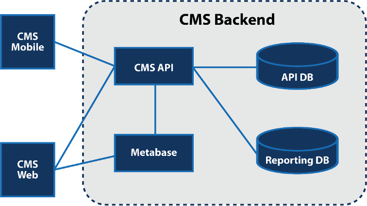

# Prototype Case Management System Programmer’s Guide

* United States Department of Labor
* Bureau of International Labor Affairs
* Office of Child Labor, Forced Labor, and Human Trafficking
* December 2020
* IMPAQ International, LLC

* SUBMITTED TO
  * United States Department of Labor
  * Bureau of International Labor Affairs
  * Office of Child Labor, Forced Labor, and Human Trafficking

* ATTENTION
  * Kevin Hong, Grant Officer’s Representative
  * Bureau of International Labor Affairs
  * United States Department of Labor
  * 200 Constitution Ave. NW
  * Washington, DC 20210

* SUBMITTED BY
  * IMPAQ International, LLC
  * 10420 Little Patuxent Parkway
  * Suite 300
  * Columbia, MD 21044
  * (443) 256-5500
  * [www.impaqint.com](https://www.impaqint.com)

* PROJECT
  * Child Labor Beneficiary Monitoring Toolkit (Toolkit)
  * Award Number: IL-26684-14-75-K-24

* TASK & DELIVERABLE
  * Prototype Case Management System
  * _Programmer’s Guide_

## ACKNOWLEDGMENTS

This is the Programmer’s Guide for the prototype case management system developed under the _Child Labor Beneficiary Monitoring Toolkit_ (Toolkit) project. IMPAQ International, LLC (IMPAQ) prepared this guide according to the terms specified in its cooperative agreement with the United States Department of Labor. IMPAQ would like to express sincere thanks to all the parties involved for their support and valuable contributions.

Funding is provided by the United States Department of Labor under cooperative agreement number IL-26684-14-75-K-24 and 100 percent of the total cost of the project is financed with federal funds, for a total of $2,246,847 dollars. This material does not necessarily reflect the views or policies of the United States Department of Labor, nor does mention of trade names, commercial products, or organizations imply endorsement by the United States government.

## TABLE OF CONTENTS

* [1. Overview of Prototype Case Management System](#1-overview-of-prototype-case-management-system)
  * [1.1 Key Concepts](#11-key-concepts)
  * [1.2 Architecture Overview](#12-architecture-overview)
  * [1.3 Backend](#13-backend)
  * [1.4 Web Application](#14-web-application)
  * [1.5 Mobile Application](#15-mobile-application)
* [2. Skills Needed by Contributing Developers](#2-skills-needed-by-contributing-developers)
  * [2.1 Backend](#21-backend)
  * [2.2 Web Application](#22-web-application)
  * [2.3 Mobile Application](#23-mobile-application)
* [3. Development Environment Setup](#3-development-environment-setup)
  * [3.1 Prototype-Case-Management-System Setup](#31-prototype-case-management-system-setup)
    * [3.1.1 Development Environment Requirements](#311-development-environment-requirements)
    * [3.1.2 Using Docker](#312-using-docker)
    * [3.1.3 Setting Up](#313-setting-up)
    * [3.1.4 Local Development](#314-local-development)
    * [3.1.5 API](#315-api)
    * [3.1.6 Web Application](#316-web-application)
  * [3.2 Mobile-Prototype-Case-Management-System Setup](#32-mobile-prototype-case-management-system-setup)
* [4. Code Overview](#4-code-overview)
  * [4.1 Prototype Case Management System](#41-prototype-case-management-system)
    * [4.1.1 `api` Directory](#411-api-directory)
    * [4.1.2 `metabase`Directory](#412-metabase-directory)
    * [4.1.3 `nginx` Directory](#413-nginx-directory)
    * [4.1.4 `postgres` Directory](#414-postgres-directory)
    * [4.1.5 `webapp` Directory](#415-webapp-directory)
  * [4.2 Mobile-Prototype-Case-Management-System](#42-mobile-prototype-case-management-system)
* [5. Data storage Design](#5-data-storage-design)
  * [5.1 Audit System](#51-audit-system)
  * [5.2 api_pg Database](#52-api_pg-database)
  * [5.3 data_pg Database](#53-data_pg-database)
  * [5.4 Importing Data](#54-importing-data)
* [6. Deployment](#6-deployment)

## LIST OF ACRONYMS

| Acronym | Literal Translation           |
|---------|-------------------------------|
| API | Application Programming Interface |
| CLI |Command-Line Interface |
| CMS | Case Management System |
| ECS | Elastic Container Service |
| HTTPS | Hypertext Transfer Protocol Secure |
| IMPAQ | IMPAQ International, LLC |
| REST | Representational State Transfer |
| SPA| Single-Page-App |
| UI | User Interface |
| VM |Virtual Machine |

## 1. OVERVIEW OF PROTOTYPE CASE MANAGEMENT SYSTEM

As part of the U.S. Department of Labor (DOL) Bureau of International Labor Affairs (ILAB) _Child Labor Participant Monitoring Toolkit Project_ (Toolkit), IMPAQ International, LLC (IMPAQ) developed a prototype web-based tool to support ILAB-funded projects in the implementation of their Direct Participant Monitoring Systems (DPMS). During the development and piloting of this prototype, ILAB identified the need for an expanded system that could track additional indicators beyond child labor, such as occupational safety and health (OSH) and working conditions, and allow project grantees, as well as other organizations, additional flexibility in developing their own forms for defining indicators and inputting data. To make these changes and build out a new Extended Prototype System, ILAB awarded IMPAQ additional funding in September 2017. IMPAQ subsequently built out a more complete extended prototype, eventually culminating in the Prototype Case Management System (CMS) outlined below.

This guide serves as a high-level overview for software developers who will be developing, modifying, or maintaining the CMS and its components. It assumes a level of knowledge of the software tools used to create the system. Where possible, it provides links to resources for development teams to learn more about these specific tools. For an overview of CMS features, please see the CMS User Manual. This guide assumes the reader has read the CMS User Manual and therefore has a general understanding of the features of the system.

### 1.1 Key Concepts

The CMS is designed to be customized by end users. Despite this fact, organizations may choose to add further functionality or modules to the system. This section provides a high-level description of the Key Concepts that should be understood before using or making any changes to the CMS.

The CMS allows users to track and collect data for **Cases**. **Cases** in the CMS have an **ID**, a **Name** and a **Description**. They can also include **Activities**, **Data Collection Forms**, **Documents**, and **Custom Fields**.

**Activities** are important actions that are taken as part of a **Case**, which projects need to collect data on and track. **Activities** in the CMS have an **ID**, **Name**, and **Description**. They can also include **Data Collection Forms**, **Documents**, and **Custom Fields**.

**Data Collection Forms** represent the forms that projects use to collect their data. The CMS allows users with the proper permission to create new Data Collection Forms, add questions to existing forms, and customize as needed. For labor inspection activities, these forms could be inspection checklists. **Responses** are the records recorded when a user fills out and submits a **Data Collection Form**.

**Custom Fields** are fields that users can add to cases or activities, such as the name of the business that owns or manages the labor inspection site or the GPS coordinates of a workplace accident. These additional fields can take the form of short text, long text, checkbox, radio button, selection field, numeric field, date field, or rank list.

**Documents** are files that can be uploaded and attached to a **Case** or **Activity**. **Documents** can be **Named** or **Arbitrary**. **Named Documents** are listed on the **Case** or **Activity** view and can be required or not. **Arbitrary Documents** are random files users can upload and relate to a **Case** or **Activity**.

The CMS allows administrators to define which **Data Collection Forms**, **Documents**, or **Custom Fields** can or should be a part of a **Case** or **Activity**, as well as which **Activities** are part of a **Case**. The mechanisms that are used to do this are **Case Types** and **Activity Types**. **Case Types** allows users to define what kind of **Cases** the system contains, such as workplace accident cases or OSH cases. **Case Types** also define what **Activities**, **Data Collection Forms**, **Documents**, and **Custom Fields** can be part of a given **Case**. **Activity Types** allows users to define various kinds of **Activities** that can be part of a **Case**, such as inspection or re-inspection **Activities**. **Activity Types** define what **Data Collection Forms**, **Documents**, and **Custom Fields** are a part of an **Activity**. Overall, **Case Types** and **Activity Types** allow the CMS to be highly customizable to the needs of a project or organization.

**Note**: In the User Manual, **Case Definitions** and **Activity Definitions** are referred to as **Case Types** and **Activity Types**. However, the CMS source code uses the original “Definitions” terminology (which was later changed to “Types” in the user interface [UI]) and, as a result, we use the source code terms in this Programmer’s Guide.

### 1.2 Architecture Overview

The CMS is a user configurable data collection and reporting system. It contains three major components: the CMS Backend, the CMS Web application, and the CMS Mobile application. Exhibit 1 illustrates the basic architecture of the CMS.

#### *Exhibit 1. CMS Architecture Overview*



The overall architecture is service-based, with a representational state transfer (REST)-based web service, a web application implemented as a single-page-app (SPA), and a mobile application. This architecture was chosen so that there would be one place for the web and mobile application to access CMS data. Using a service-based architecture also allowed for easier integration with 3rd parties and a standard interface to import and export data.

The team also considered implementing the CMS as a monolith or using micro-services. Ultimately, however, it decided that using a monolith architecture would not provide the system with the same level of flexibility as a service-based architecture. The team rejected using micro-services because properly implementing micro-services can be extremely complex. We felt that the complexity needed to implement micro-service outweighed the pattern’s positive traits.

### 1.3 Backend

The CMS Backend consists of several components. The API is implemented as a REST-based web service using Python and Flask. It uses additional Python packages, such as SQLAlchemy to communicate with the databases to implement functionality. The Backend also includes the databases the CMS uses for data storage and retrieval, which are housed in a PostgreSQL database server. The final piece of the CMS Backend is the open-source analytics engine Metabase, used for data analysis and presentation.

### 1.4 Web Application

The web application is implemented as an SPA using Angular. The web application is capable of being developed on either a Windows, Linux, or macOS environment.

### 1.5 Mobile Application

The mobile application for the CMS was created for Android and iOS using Flutter and Dart. The system is capable of being developed on either a Windows, Linux, or macOS environment. macOS is recommended since this is a cross platform application. If a macOS environment is not available, there are cloud services available to help Flutter developers using Windows or Linux.

If changes (code modifications) are made to the CMS web application or API, it may be necessary for a software developer to make changes to the mobile application.

Possible reasons for changes include (but are not limited to):

* Modifying the CMS UI or API
* Adding or removing a feature in the CMS
* Adding a feature to the mobile application that is in the CMS

It is the responsibility of the developer to test and determine what changes are needed and to ensure that the changes are implemented correctly.

## 2. SKILLS NEEDED BY CONTRIBUTING DEVELOPERS

The following is a list of technologies used in the CMS Backend, Web Application, and Mobile Application. Development teams should have a strong understanding of these technologies before making changes to the system. This guide assumes that the development team has the required knowledge of these technologies. It also, however, provides additional links to resources that may be useful when working with these technologies.

The development team should have a strong understanding of [Docker](https://docs.docker.com/get-started/) and [Docker Compose](https://docs.docker.com/compose/gettingstarted/) to be able to build and deploy the application and make changes to it. The rest of this section breaks the technologies down by component and provides additional resources for each one.

### 2.1 Backend

To understand and make changes to the Backend application code, the development team should have a strong understanding of the following technologies:

* [Python](https://www.python.org/doc/)
  * [Automate the Boring Stuff with Python, 2nd Edition: Practical Programming for Total Beginners](https://www.amazon.com/Automate-Boring-Stuff-Python-2nd/dp/1593279922/ref=sr_1_3?crid=19M8RMDYR6NGH&dchild=1&keywords=automate+the+boring+stuff+with+python&qid=1607813226&sprefix=automate+the+%2Caps%2C156&sr=8-3)
  * [Effective Python: 90 Specific Ways to Write Better Python, 2nd Edition](https://learning.oreilly.com/library/view/effective-python-90/9780134854717/)
  * [Fluent Python](https://learning.oreilly.com/library/view/fluent-python/9781491946237/)
* [Flask](https://flask.palletsprojects.com/en/1.1.x/)
  * [Flask Web Development, 2nd Edition](https://learning.oreilly.com/library/view/flask-web-development/9781491991725/)
* [SQLAlchemy](https://www.sqlalchemy.org/) / [Flask-SQLAlchemy](https://flask-sqlalchemy.palletsprojects.com/en/2.x/)
* [Flask-Migrate](https://flask-migrate.readthedocs.io/en/latest/)
* [SQLAlchemy-Continuum](https://sqlalchemy-continuum.readthedocs.io/en/latest/) / [Flask-Continuum](https://flask-continuum.readthedocs.io/en/latest/)
* [pytest](https://docs.pytest.org/en/stable/)
  * [Python Testing with pytest](https://learning.oreilly.com/library/view/python-testing-with/9781680502848/)
* [Virtual environments](https://docs.python.org/3/tutorial/venv.html)
* [Babel](http://babel.pocoo.org/en/latest/) / [Flask-Babel](https://flask-babel.tkte.ch/)
* [Jinja](https://jinja.palletsprojects.com/en/2.11.x/)
* [marshmallow](https://marshmallow.readthedocs.io/en/stable/) / [marshmallow-SQLAlchemy](https://marshmallow-sqlalchemy.readthedocs.io/en/latest/) / [Flask-Marshmallow](https://flask-marshmallow.readthedocs.io/en/latest/)
* Other Python packages list in the requirements.txt file
* [REST](https://www.codecademy.com/articles/what-is-rest)
* [PostgreSQL](https://www.postgresql.org/docs/current/index.html)
  * [Tutorials & Other Resources](https://www.postgresql.org/docs/online-resources/)
  * [PostgreSQL Tutorial](https://www.postgresqltutorial.com/)
* [SQL](https://www.w3schools.com/sql/)
  * [How to Learn SQL](https://www.datacamp.com/community/blog/how-to-learn-sql)
* [Metabase](https://www.metabase.com/docs/latest/)
  * [Discourse](https://discourse.metabase.com/) - especially helpful for troubleshooting when needed
  * [Metabase GitHub site](https://github.com/metabase/metabase)
  * [API Documentation](https://github.com/metabase/metabase/blob/master/docs/api-documentation.md)
  * [Search for Metabase](https://www.youtube.com/results?search_query=metabase)
  * [Short Metabase Demo](https://www.youtube.com/watch?v=cNqeo3Ot2JA)
  * [Metabase, a free, self-hosted, open source simple data analytics system with complex capabilities](https://www.youtube.com/watch?v=eYUnfyq7KWU)
  * [Introduction to Metabase: Tutorial Series.](https://www.youtube.com/playlist?list=PLUGOUZPIB0F-qKSlnO2pnxDXivWkvL1AG)

### 2.2 Web Application

Development teams making changes to the web application should have a strong understanding of the following technologies:

* [Angular](https://angular.io/docs)
  * [Tour of Heroes app and tutorial](https://angular.io/tutorial#tour-of-heroes-app-and-tutorial)
  * [Angular – The Complete Guide (2020 Edition)](https://www.udemy.com/share/101WAUAEYdcF9QTX4=/)
* [TypeScript](https://www.typescriptlang.org/docs)
  * [The TypeScript Handbook](https://www.typescriptlang.org/docs/handbook/intro.html)
  * [Understanding TypeScript – 2020 Edition](https://www.udemy.com/share/101sTiAEYdcF9QTX4=/)
* [Bootstrap](https://getbootstrap.com/)
* [HTML](https://developer.mozilla.org/en-US/docs/Learn/HTML/Introduction_to_HTML)
* [JavaScript](https://developer.mozilla.org/en-US/docs/Learn/JavaScript/First_steps)
  * [JavaScript – The Complete Guide 2020 (Beginner + Advanced)](https://www.udemy.com/course/javascript-the-complete-guide-2020-beginner-advanced/)
* [CSS](https://developer.mozilla.org/en-US/docs/Learn/Getting_started_with_the_web/CSS_basics)
* [Node](https://nodejs.org/en/docs/)
  * [Introduction to Node.js](https://nodejs.dev/learn)
* [NPM](https://docs.npmjs.com/)
  * [An Absolute Beginner's Guide to Using npm](https://nodesource.com/blog/an-absolute-beginners-guide-to-using-npm/)
* [REST](https://www.codecademy.com/articles/what-is-rest)

Additionally, the following site is a good introduction to web development from Mozilla: [Learn web development](https://developer.mozilla.org/en-US/docs/Learn). Mozilla also has a number of great tutorials and references on HTML, CSS, and JavaScript here: [Tutorials](https://developer.mozilla.org/en-US/docs/Web/Tutorials).

### 2.3 Mobile Application

Development teams making changes to the mobile application should have a strong understanding of the following technologies:

* [Flutter](https://flutter.dev/docs)
  * [Write your first Flutter app, part 1](https://flutter.dev/docs/get-started/codelab)
  * [Flutter & Dart – The Complete Guide [2020 Edition]](https://www.udemy.com/share/101rfIAEYdcF9QTX4=/)
* [Dart](https://dart.dev/guides)
  * [Flutter & Dart – The Complete Guide [2020 Edition]](https://www.udemy.com/share/101rfIAEYdcF9QTX4=/)
* [Android](https://developer.android.com/guide)
* [iOS](https://developer.apple.com/library/archive/referencelibrary/GettingStarted/DevelopiOSAppsSwift/)
* [REST](https://www.codecademy.com/articles/what-is-rest)
* [JSON](https://www.json.org/json-en.html)
* [SQL](https://www.w3schools.com/sql/)
  * [How to Learn SQL](https://www.datacamp.com/community/blog/how-to-learn-sql)

## 3. DEVELOPMENT ENVIRONMENT SETUP

This section provides instructions on how to set up a development environment to assist in the building, modification, or maintenance of CMS components. These instructions are subject to change as outside applications are updated. As always, software developers should use their best judgement when setting up an environment.

The CMS is available in two repositories hosted on DOL’s GitHub site. The Backend and Web Application are contained in one repository and the mobile application in another.

* [Prototype-Case-Management-System](https://github.com/USDepartmentofLabor/Prototype-Case-Management-System) – backend and web application
* [Mobile-Prototype-Case-Management-System](https://github.com/USDepartmentofLabor/Mobile-Prototype-Case-Management-System) – mobile application

It is recommended that development teams customizing their own versions of these applications fork the repositories before development begins. Information about forking a repository in GitHub can be found here [Fork a repo](https://docs.github.com/en/free-pro-team@latest/github/getting-started-with-github/fork-a-repo).

The following sections provide specific setup instructions for CMS components. Since the API and Web Application are hosted in the same repository, one section will cover setup for both components.

### 3.1 Prototype-Case-Management-System Setup

The [Prototype-Case-Management-System](https://github.com/USDepartmentofLabor/Prototype-Case-Management-System) repository contains all the CMS Backend components and the Web Application. Using this repository, development teams can make changes to the CMS and deploy the application to a Docker container service of their choice. Follow these steps to setup your local development environment. These instructions assume you are using a Unix-based operating system such as macOS or Linux.

#### 3.1.1 Development Environment Requirements

A development environment needs to provide the following:

* [Docker](https://www.docker.com/)
* [Docker Compose](https://docs.docker.com/compose/)

Other environments may be set up differently, but verified steps are provided below.

#### 3.1.2 Using Docker

Follow these steps to use Docker.

* Install [Docker](https://docs.docker.com/get-docker/)
* Install [VirtualBox](https://www.virtualbox.org/wiki/Downloads)
* Clone repository

```shell
$ git clone https://github.com/USDepartmentofLabor/Prototype-Case-Management-System.git
Cloning into 'Prototype-Case-Management-System'...
remote: Enumerating objects: 583, done.
remote: Counting objects: 100% (583/583), done.
remote: Compressing objects: 100% (413/413), done.
remote: Total 583 (delta 153), reused 580 (delta 153), pack-reused 0
Receiving objects: 100% (583/583), 4.99 MiB | 6.91 MiB/s, done.
Resolving deltas: 100% (153/153), done.
Updating files: 100% (493/493), done.
```

* Run the following commands from the ~/extended-prototype/ directory within the repository.
* Start Docker machine using `$ docker-machine start`
* Start Docker containers using `$ docker-compose up`

#### 3.1.3 Setting Up

Before we can run the full environment, we need to run an initial setup. Namely, if the `www-nginx` service is run, we need to set up some certificates so it can build and serve properly over HTTPS.

First, follow the steps listed in the follow post to generate a cert and key: [How To Create a Self-Signed SSL Certificate for Nginx in Ubuntu 16.04](https://www.digitalocean.com/community/tutorials/how-to-create-a-self-signed-ssl-certificate-for-nginx-in-ubuntu-16-04).

We only need a \*.crt and \*.key file generated. Next, write a `docker-compose.override.yml` file with the following:

```yaml
version: '3'
services:
  www-nginx:
    build:
      args:
        - SERVER_PEM=<path to server.crt>
        - SERVER_KEY=<path to server.key>
```

Then run `$ docker-compose build` to build all the services or `$ docker-compose build www-nginx` to only build the Nginx service if new certs are needed.

**Note:** These certs are self-signed and are only intended for development and testing purposes. In a production deployment, please used proper certs signed by a Trusted Authority.

Next, you’ll want to initialize the database with `$ docker-compose run eps flask db upgrade`. You will also need to initialize Metabase with `$ docker-compose run eps /eps-api/metabase/setup_metabase_docker_compose.sh`.

#### 3.1.4 Local Development

A local development environment can be built done using `$ docker-compose` up without any arguments. With default arguments, the web application is available in the browser at [https://localhost](https://localhost). The API is located at [https://api.localhost](https://api.localhost). Metabase is located at [https://metabase.localhost](https://metabase.localhost).

#### 3.1.5 API

The API is setup as a standard Python/Flask REST-based API application. It uses Python virtual environments from the standard library. Follow these sections to setup the API for local development.

##### 3.1.5.1 Creating and Activating the Python Virtual Environment

Follow these steps to create and activate your Python virtual environment.

* Run the following commands from within the `~/extended-prototype/src/api/` directory.
* `$ python3 -m venv venv`
* `$ source venv/bin/activate`
* `$ pip install -r requirements.txt`

##### 3.1.5.2 Starting the API for local development

The API is configured to run via docker-compose, with default environment values already provided. The API can be started independent of other components with `$ docker-compose up eps`. This will start the API service along with its dependencies.

##### 3.1.5.3 Testing the API

To set up the API for testing, either set the `FLASK_ENV` and `FLASK_CONFIG` environment variables to `testing` in a `docker-compose.override.yml` file. To run the tests, run one of the following commands.

`$ docker-compose run eps pytest /eps-api`

`$ docker-compose -f docker-compose.yml -f docker-compose.testing.override.yml run eps pytest /eps-api`.

##### 3.1.5.4 Development Data

To seed the application with development data, you can run:

`$ docker-compose run eps flask seed-db`

You can also optionally run the following command to load a dataset that exercises all the features of the CMS:

`$ docker-compose run eps flask load-dev-dataset`

#### 3.1.6 Web Application

The web application can be run from docker using `$ docker-compose up www-angular`. The application will be available on the browser at [http://localhost](http://localhost).

**Note**: Running the web application along with the Nginx service (such as in docker-compose up) then the web application will be available on port 443 with [https://localhost](https://localhost)

The web application can also be run manually through the following process:

* Run the following command from within the `~/extended-prototype/src/webapp/` directory in the repository.
* `$ npm install`
* `$ ng serve --host 0.0.0.0`
* Runs @ [http://localhost:4200](http://localhost:4200)

Doing so will allow for live reloading of the web application upon changes to the source files.

### 3.2 Mobile-Prototype-Case-Management-System Setup

The following is an environment for a macOS based environment. All software requirements are available free of cost, except for a Google Play Store account or Apple Developer account for distribution. Ad Hoc distribution is a cost-free alternative method.

Below is a list of development environment prerequisites:

* macOS Catalina or newer computer with administrator permissions
* Internet access
* Android device or computer capable of running an emulator
* iOS device (if targeting iOS)

Below is a list of optional development environment components:

* Multiple Android and/or iOS devices

Below are instructions on installation of the development environment:

* Following the flutter instructions at [https://flutter.dev/docs/get-started/install](https://flutter.dev/docs/get-started/install) will guide you through the current instructions for whatever OS you prefer to work on
* Set up your preferred Git tools/preferences and download the code from GitHub

## 4. CODE OVERVIEW

Since the CMS is hosted in two repositories in GitHub, this section will provide an overview of the code as it is laid out in those repositories. Links to the two repositories are provided here again for convenience.

* [Prototype-Case-Management-System](https://github.com/USDepartmentofLabor/Prototype-Case-Management-System) – backend and web application
* [Mobile-Prototype-Case-Management-System](https://github.com/USDepartmentofLabor/Mobile-Prototype-Case-Management-System) – mobile application

### 4.1 Prototype Case Management System

The [Prototype-Case-Management-System](https://github.com/USDepartmentofLabor/Prototype-Case-Management-System) repository contains the source code for the backend and web applications. It is setup so that development teams can use the Docker to setup local development environments and build and deploy the system. The top-level directory of the repository contains:

* Docker Compose files to assist in local development environment setup, testing and building and deploying
* A `src` directory which contains the source code for the backend components and web application
* A README file for quick setup instructions
* A `docs` directory which contains this document and the User Guide

The `src` directory contains directories for components of the backend and the web application. It contains the following directories.

#### _Exhibit 2. Top-level Directories_

| Directory | Contents |
|-----------|----------|
| api | The source code for the backend API. |
| metabase | Initialization and configuration files Metabase. |
| nginx | Initialization and configuration files for the Nginx web server. |
| posgres | Initialization and configuration files for the PostgreSQL database server. |
| webapp | The source code for the web application |

The following sections outline the contents of these directories.

#### 4.1.1 `api` Directory

The `api` directory contains the source code for the API component of the CMS Backend. It is a standard Python/Flask REST web service application. Major sections of the application are broken into [Flask Blueprints](https://flask.palletsprojects.com/en/1.1.x/tutorial/views/). The API also implements the [Application Factory](https://flask.palletsprojects.com/en/1.1.x/tutorial/factory/#the-application-factory) pattern to create the Flask instance. The `api` directory is laid out as such:

#### _Exhibit 3. ‘api’ Directory Contents_

| Directory | Contents |
|-----------|----------|
| app | Directory that contains the application source code. |
| data | Directory that contains data and scripts to load data, such as example datasets that can be loaded into the CMS. Example datasets include a dataset for labor inspection projects, a dataset for child labor projects, and a development dataset that contains records that utilize all configuration options. |
| docs | This directory contains documentation specific to the API. It contains an [OpenAPI](https://www.openapis.org/) Specification file and Postman files that can be imported into [Postman](https://www.postman.com/) and used to access the API endpoints. |
| migrations | This directory contains all the APIs database migrations. The API uses [Flask-Migrate](https://flask-migrate.readthedocs.io/en/latest/) for database migrations. This directory is managed by Flask-Migrate, so manual changes to its contents should be done with care. |
| tests | Testing for the API is done using [pytest](https://docs.pytest.org/en/stable/). This directory contains the pytest configuration files and tests. Tests are broken down into integration, regression, and unit. |
| translations | The API use the Python packages [Babel](http://babel.pocoo.org/en/latest/) and [Flask-Babel](https://flask-babel.tkte.ch/) for translations. This directory contains the translation files used by the application. Translation files are included for Spanish and French, although they should be reviewed before deploying the CMS. If additional translations are needed, they should be added to this directory. |
| Makefile | Makefile contain targets to assist in development, testing, and deployment. |
| README.md | README specific to the API. |
| application.py | Application startup script. Creates and starts the Flask application. This file also contains a number of [Flask Custom Commands](https://flask.palletsprojects.com/en/1.1.x/cli/#custom-commands) to build/rebuild the application databases, load the example datasets and setup a [Flask Shell](https://flask.palletsprojects.com/en/1.1.x/cli/#open-a-shell). |
| babel.cfg | This is the configuration file for Babel. |
| config.py | Python module used to configure different environments. The module provides a base configuration class which more specific environments, such as development, testing, and production, inherited from. |
| Dockerfile | Docker file used by docker to build the API container |
| requirements.txt | Python pip-based requirements f

The following table contains information about the contents of the ‘api/app’ directory.

#### *Exhibit 4. ‘api/app’ Directory Contents*

| Directory | Contents |
|-----------|----------|
| activities | This directory defines the activities Flask Blueprint. It contains all the code for the activity API endpoints. |
| activity_definitions | This directory defines the activity definitions Flask Blueprint. It contains all the code for the activity definitions API endpoints. |
| auth | This directory defines the authorization Flask Blueprint. It contains all the code for the authorization API endpoints. |
| case_definitions | This directory defines the case definitions Flask Blueprint. It contains all the code for the case definitions API endpoints. |
| case_statuses | This directory defines the case statuses Flask Blueprint. It contains all the code for the case statuses API endpoints. |
| cases | This directory defines the cases Flask Blueprint. It contains all the code for the case API endpoints. |
| files | This directory defines package to work with uploading files and case and activity documents. |
| libs | This directory contains libraries used by the application such as: A package to convert custom fields to database tables, A package to convert SurveyJS surveys to database table. |
| main | This directory defines a Flask Blueprint for generic API endpoints. Generic API endpoints include: Getting system-wide lookup and configuration information, Getting system dashboard information. It contains all the code for these endpoints. |
| notes | This directory defines a module for working with case and activity notes. |
| project | This directory defines the project Flask Blueprint. It contains all the code for the project API endpoints. |
| roles | This directory defines the roles Flask Blueprint. It contains all the code for the role’s API endpoints. |
| services | his directory contains services used by the application such as a service to communicate to the reporting database (eps_reporting_service.py), a service to send email notifications (notification_service.py). |
| surveys | This directory defines the surveys Flask Blueprint. It contains all the code for the API endpoints dealing with data collection forms and their responses. Note: Originally, data collection forms were named surveys in the system. |
| templates | This directory contains the HTML and text templates for the emails sent by the system. It uses the standard Flask templating engine [Jinja](https://jinja.palletsprojects.com/en/2.11.x/). |
| users | This directory defines the users Flask Blueprint. It contains all the code for the API endpoints that deal with users. |
| __init__.py | This file defines and configures the Flask application. It provides the create_app() function used in the Application Factory pattern. It creates and initializes the services the application needs and sets up all the Blueprints. |
| email.py | Defines functions to send emails. The system sends email notifications for the following events: A user receives an invitation email when they are added to the system, Users receive emails to reset their password when they request to reset it or when the system administrator resets it., A user receives an email when they are assigned to a case. |
| helpers.py | Defines a number of helper functions used throughout the application. |
| metabase.py | Module defining functions for working with Metabase. |
| model_schemas.py | Defines [marshmallow](https://marshmallow.readthedocs.io/en/stable/) based models used by the application. The application uses marshmallow to convert the SQLAlchemy based data models to JSON objects the API endpoints can return to the web and mobile applications. The application also use the [marshmallow-SQLAlchemy](https://marshmallow-sqlalchemy.readthedocs.io/en/latest/) and [Flask-Marshmallow](https://flask-marshmallow.readthedocs.io/en/latest/) libraries to simplify use with SQLAlchemy and Flask. |
| models.py | Defines the data models used in the system. The data models are implemented as [SQLAlchemy](https://www.sqlalchemy.org/) models. The API also uses [Flask-SQLAlchemy](https://flask-sqlalchemy.palletsprojects.com/en/2.x/) for simplified use for SQLAlchemy in a Flask application. More information about the data model used by the CMS is in Section 5. |

#### 4.1.2 `metabase` Directory

The `metabase` directory contains files to initialize and configure the [Metabase](https://www.metabase.com/) container used by the CMS. The following table outlines the contents of the directory.

#### *Exhibit 5. `metabase` Directory Contents*

| Directory | Contents |
|-----------|----------|
| Dockerfile | The Docker file used to initialize the Metabase container. |
| docker-entry.sh | Docker entry point script for the Metabase container. |
| init.py | Metabase initialization script written in Python. It performs some initial setup of Metabase such as adding an admin user, removing the sample database, changing the database Metabase users from H2 to PostgreSQL, and adding the CMS reporting database to Metabase. |
| init.sh | Metabase initialization script written as a Bash shell script. It performs some initial setup of Metabase such as adding an admin user, removing the sample database, changing the database Metabase users from H2 to PostgreSQL, and adding the CMS reporting database to Metabase. |

The `init.py` and `init.sh` scripts perform the same function and Docker only uses one of the when provisioning the Metabase container. They are both provided as a convenience.

#### 4.1.3 `nginx` Directory

The `nginx` directory contains files to initialize and configure the [Nginx](https://www.nginx.com/) container used by the application. The following table outlines the contents of the directory.

#### *Exhibit 6. `nginx` Directory Contents*

| Directory | Contents |
|-----------|----------|
| Dockerfile | The Docker file used to initialize the Nginx container. |
| docker-entry.sh | Docker entry point script for the Nginx container. |

#### 4.1.4 `postgres` Directory

The `postgres` directory contains files to initialize and configure the [PostgreSQL](https://www.postgresql.org/) container used by the application. The following table outlines the contents of the directory.

#### *Exhibit 7. `postgres` Directory Contents*

| Directory | Contents |
|-----------|----------|
| Dockerfile | The Docker file used to initialize the PostgreSQL container. |
| init.sh | A SQL script used by Docker to initialize the PostgreSQL database server. It creates the databases used by the system, adds a user for Metabase to use to communicate with the reporting database, and adds the PostGIS extension to the database used by the API. |

#### 4.1.5 `webapp` Directory

The `webapp` directory contains the source code for the CMS web application. The web application is implemented as an [Angular](https://angular.io/) application and uses [TypeScript](https://www.typescriptlang.org/) as the programming language. The top-level directory within the ‘webapp’ directory contains configuration files for [Angular](https://angular.io/), [Node](https://nodejs.org/en/)/[NPM](https://www.npmjs.com/) and [TypeScript](https://www.typescriptlang.org/). The source code for the application itself is in the ‘webapp/src/app’ directory. Details of the contents of the ‘webapp/src/app’ directory are outlined in the exhibit below.

#### *Exhibit 8. `webapp/src/app` Directory Contents*

| Directory | Contents |
|-----------|----------|
| \_components | This directory contains components reused through different sections of the application. |
| \_guards | This directory contains application guards such as a permissions directive, authorization guard, activation directive |
| \_helpers | This directory contains helper functions and components used by the application. |
| \_models | Contains TypeScript files that define the data models used by the application. |
| \_services | Angular based services used by the application to communicate with the API. |
| activities | This directory contains the components for activities and activity definitions. |
| admin | The directory contains the components for some of the application administration features such as maintaining users and roles and setting the systems default dashboard. |
| case | This directory contains components for cases and case definitions. |
| login | This directory contains the components for the login page. |
| profile | This directory contains the components work the user profile pages. |
| survey | This directory contains the components for data collection forms and responses. |
| app-routing.module.ts | Angular module defining the application’s routing. |
| app.component.css | The CSS file for the root application component. |
| app.component.html | The HTML file for the root application component. |
| app.component.ts | Defines the application’s root application component. |
| app.module.ts | Defines the Angular AppModule for the application. |

#### *Exhibit 9. `webapp/src/app/_components` Directory Contents*

| Directory | Contents |
|-----------|----------|
| _custom-fields | This directory contains components for working with custom fields. |
| add-documents-modal | Defines the component for the modal to add documents to case definitions and activity definitions. |
| add-user-modal | Defines the component for the modal when you add a user. |
| animated-loader | Defines an animated loader component used throughout the application when the application is waiting on communication with the API. |
| change-password-modal | Defines the modal component for changes a user’s password. It is used when the user changes it or when the administrator changes it. |
| dialog | Defines a generic dialog component for display messages. |
| eps-avatar | Defines the application Avatar component displaying the user’s initial and name. |
| header | Defines the header component for the application. The header component contains the top-level navigation for the application. |
| history | This directory defines components for display case and activity history. |
| landing-page | Defines the component for the landing page. |
| metabase-dashboard | Defines a component for displaying dashboards from Metabase. |
| no-permission | Defines a component shown if a user tries to do something, they do not have permission for. |
| notes | This directory contains the components for working with case and activity notes, adding notes, displaying note etc. |
| reset-password | Defines the component for a user resetting their password. |
| status-badge | Defines a component for displaying case statuses. |
| upload-documents-modal | Defines a modal component for uploaded case and activity documents. |

### 4.2 Mobile-Prototype-Case-Management-System

The [Mobile-Prototype-Case-Management-System](https://github.com/USDepartmentofLabor/Mobile-Prototype-Case-Management-System) repository contains the source code for the CMS mobile application. This section details the flutter project provided in the source code. It also covers important concepts, where appropriate.

#### *Exhibit 10. Mobile Application Components*

| Section in Source Code | Description |
|------------------------|-------------|
| custom_fields | This contains classes and widgets for use by the custom fields in the cases and activities. Included are check_box, date_time, number, radio_button, rank_list, select, text_area, and text. |
| helpers | This contains helper functions for various common functionality such as datetime formatting, color conversions, and enum value conversions. |
| localizations | This seeds the localizations used in the application. |
| models | This contains models for the application. `eps_state` is a class used to carry state for the application. This includes current credentials, database, and connectivity information. Some models include a create table statement for the local database |
| queries | This contains queries to the local database. They are named by model. |
| service_helpers | This contains helpers to run API requests. They are named by request type. |
| survey_js_render | This contains classes and widgets to render the data collection forms. This includes Boolean, checkbox, comment, dropdown, radiogroup, rating, and single_input. |
| sync | This contains classes to sync the local database against the API. |
| views | This contains all the views and their backing logic. |

## 5. DATA STORAGE DESIGN

The CMS stores its data in a PostgreSQL database server. The PostgreSQL server contains two databases, one store the applications transactional data, and one for reporting with Metabase. The transactional database is named `api_pg` and the reporting database is named `data_pg`. An audit system is also implemented within the PostgreSQL server which tracks all updates to the major data models in the system.

This section contains information on the audit system, the `api_pg` database, and the `data_pg` database. It also includes information on importing existing data into the CMS.

### 5.1 Audit System

The CMS contains an auditing system for all major data models in the system. All changes to those models are tracked in the `api_pg` database. The CMS uses the [SQLAlchemy-Continuum](https://sqlalchemy-continuum.readthedocs.io/en/latest/) Python library to implement the audit system and the [Flask-Continuum](https://flask-continuum.readthedocs.io/en/latest/) library for easier integration with Flask. The following exhibit lists the data models tracked in the system with their main and audit tables.

#### *Exhibit 11. Data Models and Audit Tables*

| App Model Name | Database Table Name | Audit Table Name |
|----------------|---------------------|------------------|
| Activity | `activities` | `activities_version` |
| ActivityDefinition | `activity_definitions` | `activity_definitions_version` |
| ActivityDefinitionDocument | `activity_definition_documents` | `activity_definition_documents_version` |
| Case | `cases` | `cases_version` |
| CaseDefinition | `case_definitions` | `case_definitions_version` |
| CaseDefinitionDocument | `case_definition_documents` | `case_definition_documents_version` |
| EPSProperty | `eps_properties` | `eps_properties_version` |
| Location | `locations` | `locations_version` |
| Note | `notes` | `notes_version` |
| Project | `projects` | `projects_version` |
| Role  | `roles` | `roles_version` |
| Survey | `surveys` | `surveys_version` |
| SurveyResponse | `survey_responses` | `survey_responses_version` |
| UploadedFile | `uploaded_files` | `uploaded_files_version` |
| User | `users` | `users_version` |

### 5.2 `api_pg` Database

The `api_pg` database is the main database for the CMS. It contains tables for all data models defined in the application. The following table describes the tables in the api_pg database.

#### *Exhibit 12. `api_pg` Tables*

| Table Name | Description |
|------------|-------------|
| `activities` | Stores activities |
| `activities_version` | Activity audit table |
| `activity_definition_documents` | Stores activity definition documents |
| `activity_definition_documents_version` | Activity definition audit table |
| `activity_definitions` | Stores activity definitions |
| `activity_definitions_surveys` | Stores relationships between activity definitions and surveys |
| `activity_definitions_version` | Activity definition audit table |
| `alembic_version` | Table used by Flask-Migrate to tract database migrations. |
| `case_definition_documents` | Stores case definition documents |
| `case_definition_documents_version` | Case definition documents audit table |
| `case_definitions` | Stores case definitions |
| `case_definitions_surveys` | Stores relationships between case definitions and surveys |
| `case_definitions_version` | Case definition audit table |
| `case_statuses` | Stores case statuses |
| `cases` | Stores cases |
| `cases_version` | Case audit table |
| `custom_fields` | Stores custom field definitions |
| `eps_properties` | Stores system-wide properties |
| `eps_properties_version` | System properties audit table |
| `locations` | Stores GPS information for cases, activities and surveys |
| `locations_version` | Location audit table |
| `notes` | Stores case and activity notes |
| `notes_version` | Note audit table |
| `projects` | Store project information |
| `projects_version` | Project audit table |
| `roles` | Stores the user roles of the system |
| `roles_version` | Role audit table |
| `survey_responses` | Stores responses to surveys |
| `survey_responses_version` | Survey response audit table |
| `surveys` | Stores surveys (data collection forms) |
| `surveys_version` | Survey audit table |
| `transaction` | Master audit transaction table used by SQLAlchemy-Continuum |
| `uploaded_files` | Stores references to uploaded case and activity files |
| `uploaded_files_version` | Uploaded files audit table |
| `users` | Stores all users of the system |
| `users_version` | User audit table |

### 5.3 `data_pg` Database

The `data_pg` database contains the tables that Metabase uses for reporting. This includes tables for cases, activities, and data collection forms. The API dynamically creates and updates tables in the `data_pg` database based on the cases, activities, and data collection forms in the system. When a user adds a case, activity, or data collection form to the system, the API will create tables in the `data_pg` database for those entities. The shape of these tables depends on the custom fields that cases and activities have and the questions that data collection forms have. This behavior is controlled by the module defined in `src/api/app/services/eps_reporting_service.py` in the CMS source code.

The tables created in the `data_pg` database are named after the entities that they are related to. Tables that hold case data are named using the pattern `<case_definition_name>_cases`. Tables that hold activity data are named using the pattern `<case_definition_name>_case_activities`. Tables that hold data for data collection forms are named after the data collection form they are related to. The table below contains examples of how `data_pg` tables could be named.

#### *Exhibit 13. `data_pg` Table Name Examples*

| Example | `data_pg` Table Name |
|---------|----------------------|
| Case Definitions Name: Wage and Hour | Cases data table name: `wage_and_hour_cases` |
| Case Definitions Name: Wage and Hour | Activity data table name: `wage_and_hour_case_activities` |
| Data Collection Form Name: COVID-19 Health Checklist | Data table name: `covid_19_health_checklist` |

### 5.4 Importing Data

It is possible to import existing data into the CMS by using the API endpoints. Please see the OpenAPI specification at `src/api/app/docs/openapi.yaml` for detailed information about the API endpoints. Developers can also use the Postman files in the `src/api/app/docs/postman` directory for examples of how to use the API endpoints. Developers can use this information to create programs to import existing data into the CMS.

## 6. DEPLOYMENT

The web application and API are deployed as one unit using Docker and Docker Compose. Using these technologies, the web components of the CMS are containerized together, with all the services they need (such as PostgreSQL and Metabase), into one image. The image can be deployed to a Docker container service such as Amazon Elastic Container Service (ECS).

For the mobile application, see the following for instructions on deploying Flutter apps:

* [https://flutter.dev/docs/deployment/android](https://flutter.dev/docs/deployment/android)
* [https://flutter.dev/docs/deployment/ios](https://flutter.dev/docs/deployment/ios)

There are also paid, commercial services to assist in deployment. A suggested service is [Codemagic](https://codemagic.io/start/).
