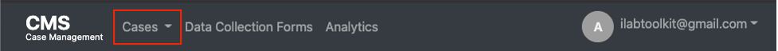
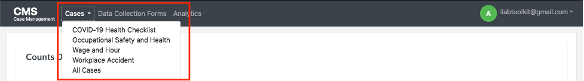
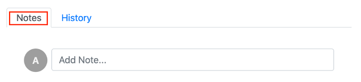
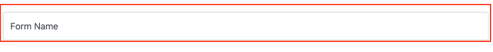
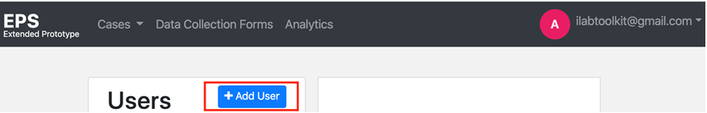

# Prototype Case Management System User Manual

* United States Department of Labor
* Bureau of International Labor Affairs
* Office of Child Labor, Forced Labor, and Human Trafficking
* December 2020
* IMPAQ International, LLC

* SUBMITTED TO
  * United States Department of Labor
  * Bureau of International Labor Affairs
  * Office of Child Labor, Forced Labor, and Human Trafficking

* ATTENTION
  * Kevin Hong, Grant Officer’s Representative
  * Bureau of International Labor Affairs
  * United States Department of Labor
  * 200 Constitution Ave. NW
  * Washington, DC 20210

* SUBMITTED BY
  * IMPAQ International, LLC
  * 10420 Little Patuxent Parkway
  * Suite 300
  * Columbia, MD 21044
  * (443) 256-5500
  * [www.impaqint.com](https://www.impaqint.com)

* PROJECT
  * Child Labor Beneficiary Monitoring Toolkit (Toolkit)
  * Award Number: IL-26684-14-75-K-24

* TASK & DELIVERABLE
  * Prototype Case Management System
  * _User Manual_

## ACKNOWLEDGMENTS

This report presents the User Manual for the prototype case management system developed under _the Child Labor Beneficiary Monitoring Toolkit_ (Toolkit) project. IMPAQ International, LLC (IMPAQ) prepared this report according to the terms specified in its cooperative agreement with the United States Department of Labor. IMPAQ would like to express sincere thanks to all the parties involved for their support and valuable contributions.

Funding is provided by the United States Department of Labor under cooperative agreement number IL-26684-14-75-K-24 and 100 percent of the total cost of the project is financed with federal funds, for a total of $2,246,847 dollars. This material does not necessarily reflect the views or policies of the United States Department of Labor, nor does mention of trade names, commercial products, or organizations imply endorsement by the United States government.

## TABLE OF CONTENTS

* [Introduction](#introduction)
* [1. Getting Started with the Web Application](#1-getting-started-with-the-web-application)
  * [1.1 Key Concepts](#11-key-concepts)
  * [1.2 Set-up Considerations](#12-set-up-considerations)
  * [1.3 User Access Considerations](#13-user-access-considerations)
  * [1.4 Accessing the System](#14-accessing-the-system)
  * [1.5 System Organization & Navigation](#15-system-organization--navigation)
    * [1.5.1 Cases](#151-cases)
    * [1.5.2 Data Collections Forms](#152-data-collections-forms)
    * [1.5.3 Analytics](#153-analytics)
    * [1.5.4 Profile Menu](#154-profile-menu)
    * [1.5.5 System Administration/Configuration](#155-system-administrationconfiguration)
  * [1.6 Exiting the System](#16-exiting-the-system)
* [2. Using the Web Application](#2-using-the-web-application)
  * [2.1 Home Page](#21-home-page)
  * [2.2 Cases](#22-cases)
  * [2.3 Creating New Cases](#23-creating-new-cases)
  * [2.4 View / Edit Cases](#24-view--edit-cases)
    * [2.4.1 Change Case Name](#241-change-case-name)
    * [2.4.2 Change Case Description](#242-change-case-description)
    * [2.4.3 Add Activity](#243-add-activity)
    * [2.4.4 View Activity](#244-view-activity)
    * [2.4.5 Delete Activity](#245-delete-activity)
    * [2.4.6 Add Document](#246-add-document)
    * [2.4.7 Add Note](#247-add-note)
    * [2.4.8 View History](#248-view-history)
    * [2.4.9 Change Status](#249-change-status)
    * [2.4.10 Assign Case to User](#2410-assign-case-to-user)
    * [2.4.11 Make Changes to Custom Fields](#2411-make-changes-to-custom-fields)
    * [2.4.12 Delete Case](#2412-delete-case)
  * [2.5 Data Collection Forms](#25-data-collection-forms)
    * [2.5.1 Add New Data Collection Form](#251-add-new-data-collection-form)
    * [2.5.2 View, Fill Out, and Submit a Response to a Data Collection Form](#252-view-fill-out-and-submit-a-response-to-a-data-collection-form)
    * [2.5.3 Change Data Collection Form](#253-change-data-collection-form)
    * [2.5.4 View Responses for Data Collection Form](#254-view-responses-for-data-collection-form)
    * [2.5.5 Download Data Collection Form Responses](#255-download-data-collection-form-responses)
    * [2.5.6 View Detail of a Data Collection Form Response](#256-view-detail-of-a-data-collection-form-response)
    * [2.5.7 Make Changes to a Data Collection Form Response](#257-make-changes-to-a-data-collection-form-response)
    * [2.5.8 Delete a Data Collection Form](#258-delete-a-data-collection-form)
    * [2.5.9 Archive a Data Collection Form](#259-archive-a-data-collection-form)
  * [2.6 Analytics](#26-analytics)
  * [2.7 Profile](#27-profile)
    * [2.7.1 Edit Profile](#271-edit-profile)
    * [2.7.2 Change Password](#272-change-password)
  * [2.8 Accessing Help](#28-accessing-help)
  * [2.9 System Administration and Configuration](#29-system-administration-and-configuration)
    * [2.9.1 Users](#291-users)
    * [2.9.2 Add Users](#292-add-users)
    * [2.9.3 Edit User](#293-edit-user)
    * [2.9.4 Roles](#294-roles)
    * [2.9.5 Create a Case Type](#295-create-a-case-type)
    * [2.9.6 Edit a Case Type](#296-edit-a-case-type)
    * [2.9.7 Delete a Case Type](#297-delete-a-case-type)
    * [2.9.8 Set Default Dashboard](#298-set-default-dashboard)
* [3. Using the Mobile Application](#3-using-the-mobile-application)
  * [3.1 Accessing the Mobile Application](#31-accessing-the-mobile-application)
    * [3.1.1 Logging In](#311-logging-in)
    * [3.1.2 Editing Password, Email, or Username](#312-editing-password-email-or-username)
    * [3.1.3 Exiting the System](#313-exiting-the-system)
  * [3.2 Mobile Application Features](#32-mobile-application-features)
    * [3.2.1 Case Type View](#321-case-type-view)
    * [3.2.2 Cases View](#322-cases-view)
    * [3.2.3 Add New Case View](#323-add-new-case-view)
    * [3.2.4 View Existing Case](#324-view-existing-case)
    * [3.2.5 Surveys View](#325-surveys-view)
    * [3.2.6 Settings View](#326-settings-view)
* [4. Troubleshooting & Support](#4-troubleshooting--support)
  * [4.1 Error Messages](#41-error-messages)
  * [4.2 Special Considerations](#42-special-considerations)
  * [4.3 Support](#43-support)

## LIST OF ACRONYMS

| Acronym | Literal Translation           |
|---------|-------------------------------|
| CMS | Case Management System |
| DOL | U.S. Department of Labor |
| DPMS | Direct Participant Monitoring System |
| EPS | Extended Prototype System |
| ILAB | Bureau of International Labor Affairs |
| IMPAQ | IMPAQ International, LLC |
| OSH | Occupational Safety and Health |
| Toolkit | Child Labor Participant Monitoring Toolkit Project |

## TABLE OF EXHIBITS

* [Exhibit 1. Recommendations for CMS User Roles](#exhibit-1-recommendations-for-cms-user-roles)
* [Exhibit 2. List of CMS Permissions](#exhibit-2-list-of-cms-permissions)
* [Exhibit 3. Recommended User Roles with Permissions](#exhibit-3-recommended-user-roles-with-permissions)
* [Exhibit 4. CMS Login Access](#exhibit-4-cms-login-access)
* [Exhibit 5. CMS Reset Password Page](#exhibit-5-cms-reset-password-page)
* [Exhibit 6. CMS Main Menu](#exhibit-6-cms-main-menu)
* [Exhibit 7. Navigation to Cases](#exhibit-7-navigation-to-cases)
* [Exhibit 8. Cases Menu](#exhibit-8-cases-menu)
* [Exhibit 9. Data Collection Forms Navigation](#exhibit-9-data-collection-forms-navigation)
* [Exhibit 10. Analytics Navigation](#exhibit-10-analytics-navigation)
* [Exhibit 11. Profile Menu](#exhibit-11-profile-menu)
* [Exhibit 12. Profile Menu Options](#exhibit-12-profile-menu-options)
* [Exhibit 13. Administrator Menu](#exhibit-13-administrator-menu)
* [Exhibit 14. User Log Out](#exhibit-14-user-log-out)
* [Exhibit 15. Home Page](#exhibit-15-home-page)
* [Exhibit 16. Case View Selection](#exhibit-16-case-view-selection)
* [Exhibit 17. Case List View](#exhibit-17-case-list-view)
* [Exhibit 18. Create New Case Form](#exhibit-18-create-new-case-form)
* [Exhibit 19. Case Page](#exhibit-19-case-page)
* [Exhibit 20. Change Case Name](#exhibit-20-change-case-name)
* [Exhibit 21. Change Case Description](#exhibit-21-change-case-description)
* [Exhibit 22. Add Activity](#exhibit-22-add-activity)
* [Exhibit 23. Navigate Adding a New Activity](#exhibit-23-navigate-adding-a-new-activity)
* [Exhibit 24. Activity Page](#exhibit-24-activity-page)
* [Exhibit 25. Delete Activity](#exhibit-25-delete-activity)
* [Exhibit 26. Add document](#exhibit-26-add-document)
* [Exhibit 27. Upload a File](#exhibit-27-upload-a-file)
* [Exhibit 28. Uploaded File](#exhibit-28-uploaded-file)
* [Exhibit 29. Notes](#exhibit-29-notes)
* [Exhibit 30. Case History](#exhibit-30-case-history)
* [Exhibit 31. Case Status](#249-change-status)
* [Exhibit 32. Assignee](#exhibit-32-assignee)
* [Exhibit 33. Change Custom Field](#exhibit-33-change-custom-field)
* [Exhibit 34. Delete a Case](#exhibit-34-delete-a-case)
* [Exhibit 35. Data Collection Forms](#exhibit-35-data-collection-forms)
* [Exhibit 36. Create New Form Page](#exhibit-36-create-new-form-page)
* [Exhibit 37. Add New Form](#exhibit-37-add-new-form)
* [Exhibit 38. Form Name](#exhibit-38-form-name)
* [Exhibit 39. Save Survey](#exhibit-39-save-survey)
* [Exhibit 40. Action Menu](#exhibit-40-action-menu)
* [Exhibit 41. Survey Responses](#exhibit-41-survey-responses)
* [Exhibit 42. View Survey Data](#exhibit-42-view-survey-data)
* [Exhibit 43. Metabase Landing Page](#exhibit-43-metabase-landing-page)
* [Exhibit 44. Ask a question](#exhibit-44-ask-a-question)
* [Exhibit 45. Type of Metabase Question](#exhibit-45-type-of-metabase-question)
* [Exhibit 46. Pick your data](#exhibit-46-pick-your-data)
* [Exhibit 47. COVID 19 Health Checklist Cases in Metabase](#exhibit-47-covid-19-health-checklist-cases-in-metabase)
* [Exhibit 48. Filter Question](#exhibit-48-filter-question)
* [Exhibit 49. Summarize Question](#exhibit-49-summarize-question)
* [Exhibit 50. Save Question](#exhibit-50-save-question)
* [Exhibit 51. Profile Menu](#exhibit-51-profile-menu)
* [Exhibit 52. Individual Profile](#exhibit-52-individual-profile)
* [Exhibit 53. Edit Profile Button](#exhibit-53-edit-profile-button)
* [Exhibit 54. Edit Profile](#exhibit-54-edit-profile)
* [Exhibit 55. Settings Button](#exhibit-55-settings-button)
* [Exhibit 56. Hidden Password](#exhibit-56-hidden-password)
* [Exhibit 57. Change Password](#exhibit-57-change-password)
* [Exhibit 58. Help Link](#exhibit-58-help-link)
* [Exhibit 59. Admin Menu](#exhibit-59-admin-menu)
* [Exhibit 60. Admin Menu and Dashboard](#exhibit-60-admin-menu-and-dashboard)
* [Exhibit 61. User List Display](#exhibit-61-user-list-display)
* [Exhibit 62. Add User](#exhibit-62-add-user)
* [Exhibit 63. Enter User Information](#exhibit-63-enter-user-information)
* [Exhibit 64. Edit User](#exhibit-64-edit-user)
* [Exhibit 65. Add Additional Roles & Permissions](#exhibit-65-add-additional-roles--permissions)
* [Exhibit 66. Change Permissions for Existing Roles](#exhibit-66-change-permissions-for-existing-roles)
* [Exhibit 67. Case Type Page](#exhibit-67-case-type-page)
* [Exhibit 68. New Case Type](#exhibit-68-new-case-type)
* [Exhibit 69. Creating a New Case Type](#exhibit-69-creating-a-new-case-type)
* [Exhibit 70. Add Activity Type](#exhibit-70-add-activity-type)
* [Exhibit 71. Creating a New Activity Type](#exhibit-71-creating-a-new-activity-type)
* [Exhibit 72. Case Type Activity Types](#exhibit-72-case-type-activity-types)
* [Exhibit 73. Add Custom Field](#exhibit-73-add-custom-field)
* [Exhibit 74. Custom Fields](#exhibit-74-custom-fields)
* [Exhibit 75. Configured Custom Fields](#exhibit-75-configured-custom-fields)
* [Exhibit 76. Select Case Data Collection Form](#exhibit-76-select-case-data-collection-form)
* [Exhibit 77. Case Type Documents](#exhibit-77-case-type-documents)
* [Exhibit 78. New Document Button](#exhibit-78-new-document-button)
* [Exhibit 79. Add New Document Dialog](#exhibit-79-add-new-document-dialog)
* [Exhibit 80. Document Section with Document Defined](#exhibit-80-document-section-with-document-defined)
* [Exhibit 81. Delete Case Type](#exhibit-81-delete-case-type)
* [Exhibit 82. Default Dashboard](#exhibit-82-default-dashboard)
* [Exhibit 83. Logging In](#exhibit-83-logging-in)
* [Exhibit 84. Editing Password, Email, or Username](#exhibit-84-editing-password-email-or-username)
* [Exhibit 85. Exiting the System](#exhibit-85-exiting-the-system)
* [Exhibit 86. Case Type View](#exhibit-86-case-type-view)
* [Exhibit 87. Cases View](#exhibit-87-cases-view)
* [Exhibit 88. New Case View](#exhibit-88-new-case-view)
* [Exhibit 89. Existing Case View](#exhibit-89-existing-case-view)
* [Exhibit 90. Existing Case View](#exhibit-90-existing-case-view)
* [Exhibit 91. Standalone Forms](#exhibit-91-standalone-forms)
* [Exhibit 92. Add Entry](#exhibit-92-add-entry)
* [Exhibit 93. View Existing Entries](#exhibit-93-view-existing-entries)
* [Exhibit 94. API URL](#exhibit-94-api-url)
* [Exhibit 95. Selected Localization](#exhibit-95-selected-localization)
* [Exhibit 96. Support Points of Contact](#exhibit-96-support-points-of-contact)

## INTRODUCTION

As part of the U.S. Department of Labor (DOL) Bureau of International Labor Affairs (ILAB) _Child Labor Participant Monitoring Toolkit Project_ (Toolkit), IMPAQ International, LLC (IMPAQ) developed a prototype web-based tool to support ILAB-funded projects in the implementation of their Direct Participant Monitoring Systems (DPMS). During the development and piloting of this prototype, ILAB identified the need for an expanded system that could track additional indicators beyond child labor, such as occupational safety and health (OSH) and working conditions and allow project grantees, as well as other organizations, additional flexibility in developing their own forms for defining indicators and inputting data. To make these changes and build out a new Extended Prototype System (EPS), ILAB awarded IMPAQ additional funding in September 2017. IMPAQ subsequently built out a more complete EPS, eventually culminating in the Prototype Case Management System (CMS) described in this User Manual, upon which a full labor-law focused CMS can be based.

The purpose of this user manual is to help new users understand how to access, navigate, and customize the CMS. The information contained within this manual will outline the development of initial case tracking and case management functionality that allows for inputting, editing, tracking, and reporting on cases at various stages within the system.

This document provides descriptions, screenshots, and corresponding narrative to demonstrate how to use the CMS and its functions and capabilities. The document also provides step-by-step procedures for accessing and using the web and mobile applications.

The source code for the CMS is publicly available, thereby allowing software developers to update or modify the system, as needed. A companion to this user guide, the programmer manual, is publicly available and provides system guidance specifically tailored to software developers.

_**This document is intended to be a template User Manual. Projects that deploy and use the CMS should customize this guide based on their project needs before distributing it to their users.**_

**Note**: The term ‘user’ is used throughout this document to refer to a person who requires and/or has acquired access to the CMS.

## 1 GETTING STARTED WITH THE WEB APPLICATION

This section describes key concepts used in the CMS, before providing guidance on how to access the CMS web application. It includes user access considerations, login steps, instructions on authorizing additional users, as well an overview of the CMS web application.

### 1.1 Key Concepts

Once deployed, the CMS is designed to be customized by end users. This section provides a high-level description of key concepts that should be understood before using the system. The details of working with these concepts are detailed in the rest of this guide.

The CMS allows users to track and collect data for **Cases**. **Cases** in the CMS have an **ID**, a **Name** and a **Description**. They can also include **Activities**, **Data Collection Forms**, **Documents**, and **Custom Fields**.

**Activities** are important actions that are taken as part of a **Case**, which projects need to collect data on and track. **Activities** in the CMS have an **ID**, **Name**, and **Description**. They can also include **Data Collection Forms**, **Documents**, and **Custom Fields**.

**Data Collection Forms** represent the forms that projects use to collect their data. The CMS allows users with the proper permission to create new Data Collection Forms; adding and customizing the associated questions, as needed. For labor inspection activities, this could be inspection forms or checklists. **Responses** are the records recorded when a user fills out and submits a **Data Collection Form**.

**Custom Fields** are fields that users can add to cases or activities, such as the name of the business that owns or manages the labor inspection site or the GPS coordinates of a workplace accident. These additional fields can take the form of short text, long text, checkbox, radio button, selection field, numeric field, date field or rank list.

**Documents** are files that can be uploaded and attached to a **Case** or **Activity**. **Documents** can be **Named** or **Arbitrary**. **Named Documents** are listed on the **Case** or **Activity** view and can be required or not. **Arbitrary Documents** are random files users can upload and relate to a **Case** or **Activity**.

The CMS allows administrators to define which **Data Collection Forms**, **Documents** or **Custom Fields** can or should be a part of a **Case** or **Activity**, as well as which **Activities** are part of a **Case**. The mechanisms that are used to do this are **Case Types** and **Activity Types**. **Case Types** allows users to define what kind of **Cases** the system contains, such as workplace accident cases or occupational safety and health cases. **Case Types** also define what **Activities**, **Data Collection Forms**, **Documents** and **Custom Fields** can be part of a given **Case**. **Activity Types** allows users to define various kinds of **Activities** that can be part of a **Case**, such as inspection or re-inspection **Activities**. **Activity Types** define what **Data Collection Forms**, **Documents**, and **Custom Fields** are a part of an **Activity**. Overall, **Case Types** and **Activity Types** allow the CMS to be highly customizable to needs of a project or organization.

### 1.2 Set-up Considerations

To access the CMS web application, users must ensure their internet access is operational. Users should also ensure that they are using the specified version or higher of the following web browsers:

* Google Chrome version 80.0.3987
* Firefox version 83.0
* Microsoft Edge version 83
* Safari version 14.0.1

### 1.3 User Access Considerations

Access to the CMS is governed by a series of roles and permissions. Permissions are assigned to roles and roles are then assigned to users. The administrator is responsible for creating roles and applying permissions to all users when creating their accounts. A recommended initial set of roles is included below.

#### _Exhibit 1. Recommendations for CMS User Roles_

| Role Name | Role Description |
|-----------|------------------|
| Administrator | Creates system user roles and permissions to support the needs of the project and acts as the IT support for the system |
| Project Manager | Manages overall cases and activities, as well as reporting aspects of the project |
| Data Collector | Collects data and enters it into the system, interviewing subjects using data collection forms |

The CMS contains a permission for almost all actions a user can perform in the system. The following table contains the permissions that exist in the system:

#### _Exhibit 2. List of CMS Permissions_

| Permission Name | Description |
|-----------------|-------------|
| Administrator | Roles with this permission can performs all system functions |
| System Installation | Can perform system installations |
| System Configuration | Can configure the system |
| Create Account | Can create accounts |
| View Account | Can view accounts. All users can view their own account. |
| Change Account | Can change accounts. All users can change their own account. |
| Deactivate Account | Can deactivate an account |
| Create Role | Can create a role |
| View Role | Can view roles |
| Change Role | Can change roles |
| Delete Role | Can delete roles |
| Create Data Collection Form | Can create a data collection form |
| View Data Collection Form | Can view data collection forms |
| Change Data Collection Form | Can change data collection forms |
| Delete Data Collection Form | Can delete data collection forms |
| Submit Data Collection Form | Can fill out and submit data collection forms |
| Archive Data Collection Form | Can archive data collection forms |
| View Report | Can view reports |
| Create Case Definition | Can create case definitions |
| View Case Definition | Can view case definitions |
| Change Case Definition | Can change case definitions |
| Delete Case Definition | Can delete case definitions |
| Create Case | Can create cases |
| Read Case | Can view cases |
| Change Case | Can change cases |
| Delete Case | Can delete cases |
| Assign to a Case | Can assign a case to a user |
| Assignable to a Case | User is assignable to a case |
| Reset Reporting Database | Can perform a reset of the reporting database |
| Create Activity Definition | Can create activity definitions |
| View Activity Definition | Can view activity definitions |
| Change Activity Definition | Can change activity definitions |
| Delete Activity Definition | Can delete activity definitions |
| Create Activity | Can create activities |
| View Activity | Can view activities |
| Change Activity | Can change activities |
| Delete Activity | Can delete activities |
| Change Status | Can change a case’s status |

To illustrate how user roles map to permissions, the following table maps the initial recommended roles listed in Exhibit 1 to the permissions each role should have. This is an example of how a project could configure their system roles. Projects should configure their roles based on their specific needs and requirements.

#### _Exhibit 3. Recommended User Roles with Permissions_

| Role Name | Permissions |
|-----------|-------------|
| Administrator | Administrator |
| Project Manager | System Configuration, View Account, Change Account, Create Data Collection Form, View Data Collection Form, Change Data Collection Form, Delete Data Collection Form, Submit Data Collection Form, Archive Data Collection Form, View Report, Create Case Definition, View Case Definition, Change Case Definition, Delete Case Definition, Create Case, Read Case, Change Case, Delete Case, Assign to a Case, Assignable to a Case, Create Activity Definition, View Activity Definition, Change Activity Definition, Delete Activity Definition, Create Activity, View Activity, Change Activity, Delete Activity, Change Status |
| Data Collector | View Account, Change Account, View Data Collection Form, Submit Data Collection Form, View Report, Create Case, Read Case, Change Case, Assignable to a Case, Create Activity, View Activity, Change Activity |

### 1.4 Accessing the System

Users must have an account in the CMS to access the system. Users should contact their system administrator to request an account. In order to access the CMS, users must visit the web address established by their system administrator. The CMS login page, presented below, requires an authorized user to enter their email address and password.

#### _Exhibit 4. CMS Login Access_


If the user does not remember their password, they should select the **Forgot your password?** link to reset their password. Clicking the link will display the following page.

#### _Exhibit 5. CMS Reset Password Page_


Users should enter their email address in the **Email Address** text box and click the **Request Reset Link** button. When the user clicks the **Request Reset Link** button, they will be sent an email with instructions on how to reset their password.

**Note**: If a user enters an email address that does not exist in the system, the application will not inform the user. To the user, the application with behave the same whether they enter an email address known to the system or not. This behavior is by design. Entities that try to gain access to systems use reset password forms to try to gain knowledge about a system. If a reset password form tells the user that an email address is invalid, then someone trying to gain access to the system can figure out what emails addresses are valid and work to exploit a system with those email addresses.

### 1.5 System Organization & Navigation

The CMS is divided into following main parts:

* Cases
* Data Collections Forms
* Analytics
* System Administration/Configuration

Each part can be accessed via the main menu at the top of the web application, as shown below.

#### _Exhibit 6. CMS Main Menu_


#### 1.5.1 Cases

The Cases section of the CMS is where users can work with cases. In the Cases section, users can perform the following actions:

* View, search, and sort the list of cases
* Create new cases
* Make changes to cases
* Assign users to cases
* Change the status of cases
* Create, change and delete a case’s activities
* Upload documents for a case
* Make notes on a case

Users can access the Cases section of the CMS by clicking the down arrow on the Cases link in the **Top Menu Bar**.

#### _Exhibit 7. Navigation to Cases_



When clicking the Cases link, a dropdown will appear allowing the user to view cases by **Case Type** or all cases.

#### _Exhibit 8. Cases Menu_


#### 1.5.2 Data Collections Forms

The Data Collection Forms section of the CMS is where users can work with the data collection forms in the system. In the Data Collection Forms section, users can perform the following actions:

* View list of all data collection forms in the system
* Create a new data collection form
* View, fill out, and submit a response to a data collection form
* Make changes to a data collections form
* Delete a data collection form
* Archive a data collection form

Users can access the Data Collections Forms section by clicking the **Data Collection Forms** link in the **Top Menu Bar**.

#### _Exhibit 9. Data Collection Forms Navigation_


#### 1.5.3 Analytics

The CMS uses the open-source data science and analytics tool Metabase for customizable analysis of case data and dashboarding. More details on using Metabase can be found in Section 2.6. Clicking the **Analytics** link in the **Top Menu Bar** will take users to Metabase. The link will open Metabase in another window in the user’s web browser.

#### _Exhibit 10. Analytics Navigation_


#### 1.5.4 Profile Menu

The **Profile Menu** is displayed on the right side of the **Top Menu Bar**. The **Profile Menu** displays the email address of the user that is logged into the CMS.

#### _Exhibit 11. Profile Menu_


From the **Profile Menu**, users can access their profile information, access help, or log out of the system.

#### _Exhibit 12. Profile Menu Options_


#### 1.5.5 System Administration/Configuration

The system administration and configuration sections of the CMS can be accessed by clicking the down arrow on the **Profile Menu** in the **Top Menu Bar** (see Exhibit 11). After clicking the Profile Menu, if the user has Administrator permissions, the Administrator Menu will appear.

#### _Exhibit 13. Administrator Menu_


Administrators can use this menu to perform system administration and configuration functions such as:

* Maintaining the Users of the system
* Maintaining the Roles of the system
* Maintaining what kinds of Cases the system supports (Case Types)
* Setting the default dashboard users see when they first login

Each of these functions is explained further in Section 2.7.

### 1.6 Exiting the System

In order to exit the CMS web application, the user will simply need to click **Log Out** in the drop-down menu on the upper right corner.

#### _Exhibit 14. User Log Out_


Users will also automatically be logged out if they close their web browser or the tab in the browser they were using for the CMS.

## 2. USING THE WEB APPLICATION

The following sub-sections provide detailed, step-by-step instructions on how to use the various functions and features of the Prototype CMS web application. This section is broken down into the following subsections: Home Page, Cases, Data Collections Forms, Analytics, and System Administration/Configuration.

### 2.1 Home Page

Upon entering the CMS web application, the users are greeted with the **Home Page**. The **Home Page** displays the default dashboard for the CMS. All users of the system see the same default dashboard, which is set by a system administrator. Please see Section 2.9 for detail on how an administrator can set the system’s default dashboard. The **Home Page** can also be accessed from any other part of the web application by clicking the CMS icon in the top left corner of the **Top Menu Bar**.

#### _Exhibit 15. Home Page_


### 2.2 Cases

Users have the option of viewing all cases or only those associated with a specific case type in the system. Using the **Cases** dropdown on the **Top Menu Bar** users can select the **Case Type** they want to view the cases for or select *All Cases** to view all cases in the system.

#### _Exhibit 16. Case View Selection_



When the user clicks the case type from the **Cases** drop down on the **Top Menu Bar**, the **Case List View** will be displayed, as shown below.

#### _Exhibit 17. Case List View_


From this page, users can sort the list by each column, search the list by entering a search term in the **Search** box, and page through the list by using the pagination controls and the “Show xx entries” dropdown. Searching will search all the columns that are shown in the list and all the entries regardless of the entry’s page in pagination. The Search however will not search all the properties for a case such as notes, uploaded documents and other properties displayed on the **Case View**. The **Case View** is introduced in Section 2.4.

Users can also create a new case by clicking the **Create New Case** button and navigate to an existing case page by clicking on a specific row in the table.

### 2.3 Creating New Cases

When a user clicks the **Create New Case** button, they will be taken to the **Create New Case Form**.

#### _Exhibit 18. Create New Case Form_


Using the form, the user can add a new case to the system. To add a new case, users should follow this procedure:

1. Select a Case Type. **Note**: _Once the user selects a case type, the case type’s custom fields will be displayed on the form, since each case type can have its own set of custom fields._
2. Enter a unique name for the case
3. Optionally add a description for the case
4. Optionally assign a user to the case
5. Optionally fill out the custom fields
6. Optionally add an initial note
7. Click the **Save New Case** button to add the case to the system
8. Click the **Cancel** button to cancel adding the case to the system

After the new cases have been created, they will appear on the case list.

### 2.4 View / Edit Cases

When a user clicks a row on the **Case Table**, the **Case Page** will be displayed.

#### _Exhibit 19. Case Page_


From the **Case Page**, users can perform the following functions depending on their permissions.

* Change the case’s name
* Change the case’s description
* Add an activity to the case
* View a case’s activities
* Delete a case’s activities
* Add a document
* Add a note
* View the case’s history
* Change the case’s status
* Assign the case to a user
* Make changes to the case’s custom fields
* Delete a case

The following sections detail those functions.

#### 2.4.1 Change Case Name

To change the case’s name, click the case name. Clicking the case name will allow the case’s name to be changed. Once you are done make changes click the check mark to save your changes or the X to cancel.

#### _Exhibit 20. Change Case Name_


#### 2.4.2 Change Case Description

To change the case’s description, click the case description. Clicking the case description will allow the case’s description to be changed. Once you are done make changes click the check mark to save your changes or the X to cancel

#### _Exhibit 21. Change Case Description_


#### 2.4.3 Add Activity

Follow this procedure to add a new activity to the case.

1. Click the **Add activity** button on the **Case Menu Bar**

#### _Exhibit 22. Add Activity_


2. Fill out the **Add New Activity** dialog by choosing the kind of activity, entering a name for the activity (required), and optionally entering a description and an initial note.

#### _Exhibit 23. Navigate Adding a New Activity_


3. Click the Save button to add the activity to the case and system
4. Or click the Cancel button to cancel adding the activity

#### 2.4.4 View Activity

To view an activity, click the activity name on the case’s activity list. This will take the user to the **Activity Page** where they can make changes to the activity.

#### _Exhibit 24. Activity Page_


From this page, users can perform the following functions on an activity. **Note:** _Much of this functionality works the same as for Cases._

* Change the activity’s name
* Change the activity’s description
* Set the activity as **Complete**. Note that an activity can be changed back to show as not complete, if needed. The user that set or unset the activity as complete, as well as a timestamp of when each change was made, is stored in the main activity table. Additionally, all changes are maintained in the activity versions table.
* Submit data collection forms associated with the activity
* Add notes
* View history

#### 2.4.5 Delete Activity

Users that have the **Delete Activity** permission can delete an activity by clicking the red trash can icon on the row of the activity that needs to be deleted. The activity will be deleted from the main activity table, but a record of the deletion is kept in the activity versions table.

#### _Exhibit 25. Delete Activity_


#### 2.4.6 Add Document

A user can add a document to the case by following this procedure.

1. Click the **Add Document** button on the **Case Menu Bar**

#### _Exhibit 26. Add document_


2. This will open the **Upload a file** dialog, drag & drop or browse to a file from your system

#### _Exhibit 27. Upload a File_


3. Click the **Upload File** button
4. The uploaded file will appear within the **Documents** section of the **Case Page**

#### _Exhibit 28. Uploaded File_


#### 2.4.7 Add Note

Users can view and add notes clicking on the **Notes** tab at the bottom of the **Case Page**.

#### _Exhibit 29. Notes_



To add a note to the case, follow these steps.

1. Click in the empty note textbox and enter the notes text.
2. Click the checkmark to save or the X to cancel.

#### 2.4.8 View History

Uses can view the history of the Case by clicking the **History** tab on the bottom of the **Case Page**.

#### _Exhibit 30. Case History_


The history for cases in maintained is a case versions table. Changes to cases are kept in that table. When a case is deleted, it will be removed from the main case table, but a record of the deletion is recorded in the case versions table.

#### 2.4.9 Change Status

Users can change the status of a **Case** by selecting the new case from the case status drop down on the right column of the **Case Page**.

#### _Exhibit 31. Case Status_


Changes are automatically saved back to the server once you click on an option from the dropdown menu. The list of case statuses listed in Exhibit 31 are example statuses for use in a labor inspection CMS. However, the list of case statuses is customizable, and the project team should work with their technology team member(s) to create their project’s case statuses when the CMS is deployed.

One status can be designed as the final status. If there is a final status and the user changes the status to the final status, but all the required documents have not been uploaded, the system will display an error message to the user and will not change the status. Designating a status as the final status can be done when the project team works with their technology team member(s) to define their project’s case statuses.

#### 2.4.10 Assign Case to User

Users with the **Assign to a Case** permission can assign a user to the case by selecting a user from the **Assignee** drop down on the right column of the **Case Page**.

#### _Exhibit 32. Assignee_


Changes are immediately saved to the server.

#### 2.4.11 Make Changes to Custom Fields

A case’s custom fields are displayed in the right column of the **Case Page**.

#### _Exhibit 33. Change Custom Field_


Users can make changes to the case’s custom fields in place and changes are immediately saved to the server. Projects can also customize the custom fields associated with the cases. Customizing case custom fields is discussed in Section 2.9.

#### 2.4.12 Delete Case

Users that have the **Delete Case** permission can delete a case by choosing the **Delete** option from the **Case Action Menu** on the right side of the **Case Page**.

#### _Exhibit 34. Delete a Case_


Note that this will delete the case and all its associated activities, data collection forms, documents and notes from the system.

### 2.5 Data Collection Forms

When accessing the Data Collection Forms section of the CMS, users will see a list of all of the different types of data collection forms in the system.

#### _Exhibit 35. Data Collection Forms_


Within the Data Collection Forms sections, users with the appropriate permission can perform the following actions:

* Create a new data collection form
* View, fill out, and submit a response to a data collection form
* Make changes to a data collection form
* View responses to a data collection form
* Delete a data collection form
* Archive a data collection form

The **Data Collection Forms** functionality in the CMS is built using [SurveyJS](https://surveyjs.io/). SurveyJS is a software library for building “fully-customizable surveys, forms and quizzes that seamlessly integrate into your application”. This guide will provide certain information on creating **Data Collection Forms** using SurveyJS, however for detailed information, please see the [Survey Creator / Form Builder](https://surveyjs.io/Documentation/Survey-Creator) Overview on the SurveyJS website.

#### 2.5.1 Add New Data Collection Form

Users can add new data collection forms by following this procedure.

1. Click the Add New Form button on the Data Collection Forms list page

#### _Exhibit 36. Create New Form Page_


2. This will open the Create New Form Page.

#### _Exhibit 37. Add New Form_


3. Enter a unique Form Name

#### _Exhibit 38. Form Name_



4. Build your data collection form. The Create New Form page provides a user-friendly data collection form building experience. Users can drag and drop questions onto their form from the Toolbox. The form builder provides many different question types such as Single Input, Checkbox, Comment, Dropdown, etc. Other features that the builder provides include:
    * Creating multiple sections or multiple pages
    * Showing or hiding questions or sections or pages based on the response to previous questions
    * Designating questions as required based on the response to previous questions
    * Designating one language for the whole form or supporting the form in multiple languages
    * Implementing data validation on the types of data collected (numbers, dates, etc.) with customized error messages
    * Implementing conditional data validation based on responses to a question or multiple questions (i.e. if a user answers question 1 this way then the only valid responses to question 2 are: a, b, or c).

    Full documentation on using the SurveyJS Survey Creator to create Data Collection Forms can be found here Survey Creator / Form Builder Overview.

5. Once the user has built the form to their needs, click the Save Survey button to save the data collection form to the system

#### _Exhibit 39. Save Survey_


Clicking the **Survey Settings** button allows the user to change settings for the Data Collection Form such as the title, add a logo, change the text of form navigation buttons, customize the completion message and many other settings.

The following actions can be accessed for individual data collection forms by clicking the **Action Menu Button** () on the form’s line. Clicking the **Action Menu Button** displays the **Action Menu**.

#### _Exhibit 40. Action Menu_


#### 2.5.2 View, Fill Out, and Submit a Response to a Data Collection Form

Users can fill out and submit responses to data collection forms choosing the **View Form** option on the **Action Menu**. This will display the data collection form where users can fill out the questions and once done can click the **Complete** button at the button of the form.

#### 2.5.3 Change Data Collection Form

To make changes to a pre-existing data collection form, click the **Edit Form** option on the **Action Menu**. This will open the form in the builder. Once there, any necessary changes to the form can be made. Click the **Save Survey** button to save your changes to the system. Note that new data collected using the form will reflect the new format. If a question is added, the new response records will have that data but responses from before the change will not. If a question is removed, responses collected from then on will not have that data but responses from before the change will.

#### 2.5.4 View Responses for Data Collection Form

You can view the responses for a data collection form by clicking the **View Responses** option on the **Action Menu**.

Clicking the **View Responses** option will display the responses for that data collection form.

#### _Exhibit 41. Survey Responses_


From this page, you can download the response data, view the detail of an individual response, and make changes to a response. The download will be in JSON format with records following the format:

```json
[ 
  { 
    "question1": "answer1", 
    "question2": "answer2",
  ...
  }, { 
    "question1": "answer1", 
    "question2": "answer2",
    ...
  },
  ...   
]
```

#### 2.5.5 Download Data Collection Form Responses

You can download the responses for a data collection form by clicking the **Download** button at the top of the responses page.

#### 2.5.6 View Detail of a Data Collection Form Response

You can view the detail for an individual response by clicking on the response.

#### _Exhibit 42. View Survey Data_


#### 2.5.7 Make Changes to a Data Collection Form Response

Once you are viewing an individual data collection response, users with the **Change Data Collection Form** permission can make changes to the data and click the **Complete** button at the bottom of the response form. These changes are tracked within the system’s auditing tables.

#### 2.5.8 Delete a Data Collection Form

Users with the **Delete Data Collection Form** permission can delete a data collection form from the system by clicking the **Delete Form** option on the **Action Menu**. This will completely delete the data collection form and all its associated responses from the system. Before deleting, you will be asked to confirm that you want to delete the data collection form. The deletion is tracked in the systems auditing tables and can be recovered with the help of technical resource that understands working with relational database systems.

#### 2.5.9 Archive a Data Collection Form

A better option to deleting is archiving a Data Collection Form. Users with the **Archive Data Collection Form** permission can archive data collections forms by clicking on the **Archive Form** option on the **Action Menu**. This action will hide the form and its related responses from general use but will not completely delete it from the system. Data Collection Forms can also be unarchived.

### 2.6 Analytics

As previously mentioned, the CMS utilizes the open-source data science and analytics platform Metabase for data analysis needs. When a user clicks the **Analytics** button another tab or window will open in their browser and they will be taken to the Metabase Landing Page.

#### _Exhibit 43. Metabase Landing Page_


The Metabase landing page is customizable by administrators. In the screenshot above, the landing page is customized to display a link to the dashboard that is configured to the default dashboard in the CMS, a link to a collection called “Our Analytics” and a link to the data from the CMS “EPS Data”. The “Our Analytics” collection is a shared collection of artifacts (dashboards, questions and other collections) created in Metabase that users of the system share with each other.

The basic concept in Metabase is that users can ask various questions about their data. You can ask a question by clicking the **Ask a question** link in the top menu.

#### _Exhibit 44. Ask a question_


Clicking the Ask a question button takes the user to a screen asking what kind of question you want to ask.

#### _Exhibit 45. Type of Metabase Question_


Selecting Simple question or Custom question will lead you to select your data source(s), while selecting Native query will drop you into an editor where you can write SQL directly against your data sources.

#### _Exhibit 46. Pick your data_


Picking your data will take you to a page that lists all the records for the table. In our case below, all the rows for the COVID 19 Health Checklist Cases.

#### _Exhibit 47. COVID 19 Health Checklist Cases in Metabase_


From this page, you can filter the records by clicking the **Filter** button.

#### _Exhibit 48. Filter Question_


Or summarize the data by clicking the **Summarize** button.

#### _Exhibit 49. Summarize Question_


And once you done, you can save your question by clicking the **Save** button and filling in the **Save question** dialog.

#### _Exhibit 50. Save Question_


Questions can be added to collections or combined into a dashboard.

This is just a small preview of the capabilities of Metabase. Metabase is an extremely powerful and comprehensive data analytics platform and this document cannot do it justice in explaining how to use it. We point the user to the documentation and tutorials below, which provide detailed information and instruction on using Metabase.

**Metabase Documentation**

* [Metabase documentation](https://www.metabase.com/docs/latest/)
* [Discourse](https://discourse.metabase.com/) – (especially helpful for troubleshooting when needed)
* [Metabase GitHub site](https://github.com/metabase/metabase)
* [API Documentation](https://github.com/metabase/metabase/blob/master/docs/api-documentation.md)

**Online Metabase Tutorials**

* [Search for Metabase](https://www.youtube.com/results?search_query=metabase)
* [Short Metabase Demo](https://www.youtube.com/watch?v=cNqeo3Ot2JA)
* [Metabase, a free, self-hosted, open source simple data analytics system with complex capabilities](https://www.youtube.com/watch?v=eYUnfyq7KWU)
* [Introduction to Metabase: Tutorial Series](https://www.youtube.com/playlist?list=PLUGOUZPIB0F-qKSlnO2pnxDXivWkvL1AG)

### 2.7 Profile

The **Profile** section of the CMS is where users can view and make changes to their profile information. Users can access their profile by clicking the **Profile** link in the **Profile Menu**. The email address shown on the **Profile Menu** is the email address of the logged in user.

#### _Exhibit 51. Profile Menu_


Clicking the **Profile** link will display the user’s profile page.

#### _Exhibit 52. Individual Profile_


On the Profile Page, users can perform the following actions:

* Edit their profile, including changing their email address, username, name, and location.
* Change their password

#### 2.7.1 Edit Profile

Users can edit their profile information by following this procedure.

1. On the **Profile** Page, click the **Profile** button and then click the **Edit Profile** button.

#### _Exhibit 53. Edit Profile Button_


2. Enter values for one or more of **Email Address**, **Username**, **Name** and **Location**.

#### _Exhibit 54. Edit Profile_


3. Click the **Save** button
4. Or click the **Cancel** button to cancel making changes to the profile information

#### 2.7.2 Change Password

Users can change their password by following this procedure.

1. Clicking the **Settings** button on the Profile Page

#### _Exhibit 55. Settings Button_


2. Click the **Hidden** password value

#### _Exhibit 56. Hidden Password_


3. Enter their **New** and **Confirm Password** in the **Change Password** dialog

#### _Exhibit 57. Change Password_


4. Click the **Change Password** button
5. Or Click the **Cancel** button to cancel changing their password.

### 2.8 Accessing Help

Users can access the User Manual by clicking the **Help** link on the **Profile Menu**.

#### _Exhibit 58. Help Link_


### 2.9 System Administration and Configuration

All the system administration and configuration functions can be accessed from the **Administrator Menu** on the **Profile Menu**. The **Administrator Menu** will only be displayed if the user has Admin permission.

#### _Exhibit 59. Admin Menu_


From the **Administrator Menu**, users can administer the following items.

* Users
* Roles
* Case Types
* Set the Default System Dashboard

#### 2.9.1 Users

To administer users of the CMS, a user that has administrative rights will log into the system and clicks the **Users** option on the **Administrators Menu**. The exhibit below presents the CMS administrator menu along with additional menu items that will appear.

#### _Exhibit 60. Admin Menu and Dashboard_


Once the admin user selects the **Users** menu option the **User List** is displayed.

Users cannot be deleted from the system. Users are not deleted because all changes to the system are recorded in a set of audit tables including which user made the change. Users can be deactivated which is further discussed in Section 2.9.3.

#### _Exhibit 61. User List Display_


Using this list, the admin user can add new users and make changes to existing users.

#### 2.9.2 Add Users

Admin users can add new users to the CMS by following these steps.

1. Click the **Add User** button

#### _Exhibit 62. Add User_



2. Enter the user’s **Email Address**, **Username**, and **Name** and choosing a **Role** for the user.

#### _Exhibit 63. Enter User Information_


3. Click the **Save** button to add the new user or **Cancel** to cancel adding the user.

Once an administrator has added a user to the system, they will receive an email inviting them to the system. The email contains instructions on accessing and logging into the system.

#### 2.9.3 Edit User

An administrator can edit a user by clicking on a user’s entry on the users list. Once they click the user entry, the user’s information will be displayed.

#### _Exhibit 64. Edit User_


From the **Edit User Form** the administrator can change the user’s **Email Address**, **Username**, **Name**, **Role**, or **Location**. The administrator can change a user’s password by clicking the **Change Password** link. This allows administrators to change a user’s password if they are having trouble using the **Forgot your password?** link on the **Login Page**. The administrator can also resend an invitation email to the user by clicking the **Resend Welcome Email** button.

Admin users can also deactivate a user by clicking the **Deactivate Account** switch. Users can be deactivated and re-activated by toggling the switch. If a user is deactivated, their account will still exist in the system but they will not be able to login. Users are deactivated and not deleted because all changes to the system are recorded in a set of audit tables, including which user made the change.

#### 2.9.4 Roles

When the CMS is first deployed the only role that will exist is the Admin role. Administrators should add additional roles to their system by following these instructions.

In order to add additional roles, the systems administrator will click the Roles option on the **Administrator Menu**. This action will display the **Roles Page**. Follow these steps to add a new role.

1. Click **Add New Role** button
2. Click the **_Role Name_** field and type in the name of the new Role
3. Select the appropriate check boxes under the **Add Permissions** section to assign the new Role a set of permissions
4. Click **Save** to save the new Role with the set of permissions you have selected

#### _Exhibit 65. Add Additional Roles & Permissions_


\*_The new role can also be set as a default role if the “Set to default” checkbox is selected_

In order to change permissions for existing roles, the systems administrator will click the dropdown menu as shown below, click **Roles**. In this example, we will use the Project Manager role. Follow these steps to change permissions:

1. Click on Project Manager
2. Select or deselect the set of permissions you want to change for the Project Manager
3. Click Save

#### _Exhibit 66. Change Permissions for Existing Roles_


#### 2.9.5 Create a Case Type

Case Types are containers around a case. They define what is part of a case. They should contain all important artifacts about a case, such as Case Type Name, a unique Key, Description (optional), Activities, Custom Fields, Surveys, and Documents.

In order to get started with creating a Case Type, upon logging in, the Administrator will choose the **Case Types** option on the **Administrator Menu**. This will display the **Case Type Page**.

#### _Exhibit 67. Case Type Page_


Administrators can create new Case Types by clicking the **+ New Case Type** button.

#### _Exhibit 68. New Case Type_


After an Administrator has successfully navigated to the **New Case Type** page, they will need to at least enter a Name and Key before they can create the case type. The Key should be a short unique string to uniquely identify the Case Type. An example would be OSH for “Occupational Safety and Health” cases.

#### _Exhibit 69. Creating a New Case Type_


Even though the only fields that are required for Case Types are the Name and Key, the administrator will want to customize the other elements of a Case Type including Activity Types, Custom Fields, Data Collection Forms and Documents.

##### Activity Types

Administrators can define what kinds of activities cases can include by adding Activity Types to the Case Type defining the case. Defining the Activity Types for a Case Type is managed using the **Activity Types** section of the **Case Type** form and administrators can add an **Activity Type** to a **Case Type** by clicking the **+ New Activity** button.

#### _Exhibit 70. Add Activity Type_


Clicking the **+ New Activity** button displays the **Create Activity Type** form. Using this form, administrators can add a name and description to the activity type and configure the **Custom Fields**, **Data Collection Forms** and **Documents** defined for the activity type.

#### _Exhibit 71. Creating a New Activity Type_


The process for configuring custom fields, data collection forms, and documents is the same for case types and activity types. The reader is taken directly to the relevant sections below for configuring these items for case types.

When the administrator has configured the activity type as needed, they click the **Save** button to add the activity type to the case type. At which point, the activity types will be listed in the **Activity Type** section of the **Case Type** form.

#### _Exhibit 72. Case Type Activity Types_


##### Custom Fields

The purpose of adding Custom Fields is to allow users to define properties for Cases beyond just the name and description. These properties will be displayed on the Case View and users will be able to enter in data for these properties on the Case form.

Administrators can add “Custom Fields” to a Case Type by using the **Custom Fields** section of the **Case Type** form and clicking the **+ New Field** button.

#### _Exhibit 73. Add Custom Field_


Clicking the **+ New Field** button will open the **Add New Custom Field** dialog. The Custom Field consists of a Field Name, optional Placeholder Text, optional Help Text, and list of Custom Field Types to select from. To add a Custom Field after clicking “+ New Field”, follow these steps:

1. Click the **Field Name** field and type in your Custom Field name
2. Select the drop-down menu and click on a field type to choose what kind of custom field
3. Click **+Add Option** and type in the data the users will be able to select if the kind of custom field selected requires it
4. Click **+Add New Field** to add the new Custom Field to the Case Type.

#### _Exhibit 74. Custom Fields_


#### _Exhibit 75. Configured Custom Fields_


##### Data Collection Forms

Administrators can designate which data collection forms are associated with a case using the **Forms** section. The **Forms** section displays all the unarchived data collection forms in the system. Administrators associate a form with a case by checking the checkbox next to the form name.

#### _Exhibit 76. Select Case Data Collection Form_


##### Documents

Administrators can define files to be uploaded for the **Case Type**. This can be accomplished using the **Documents** section of the **Case Type** form.

#### _Exhibit 77. Case Type Documents_


Documents can be designated as required or not. If the document is designated as required, users will be required to upload the document before the case can be considered done.

Administrators define documents for a case type by clicking the **+ New Document** button in the **Documents** section.

#### _Exhibit 78. New Document Button_


Clicking the **+ New Document** button will open the **Add New Document** dialog. Using this dialog, administrators enter a name for the document, select whether the document is required and click the **Add Document** button.

#### _Exhibit 79. Add New Document Dialog_


Once the document has been added, it will be displayed in the **Documents** section. Administrators can click the **Remove Document** button () if they decide they do not need the document.

#### _Exhibit 80. Document Section with Document Defined_


It should be noted that case types and therefore cases do not have to have documents defined for users to upload related files. They can upload arbitrary files that are needed for the case.

#### 2.9.6 Edit a Case Type

After a new **Case Type** has been created, administrators can go back and make changes to the case types. Administrators make changes to a **Case Type** by selecting the relevant **Case Type** on the **Case Types** page. The processes of making changes to a **Case Type** are the same as when creating a **Case Type**. Changes to **Case Types** are tracked in the system’s audit tables. Data collected moving forward for the cases defined by the case type will reflect the new definition. Data previously collected retain the definition of the case type at the time the data was collected.

#### 2.9.7 Delete a Case Type

Administrators can delete **Case Types** by clicking the **Delete Type** button in the action menu on the **Case Type** page. The administrator will be asked to confirm the deletion.

#### _Exhibit 81. Delete Case Type_


Deleting a **Case Type** will delete the case type and all its related cases. The deletion is tracked in the system audit tables and the data can be restored with the help of a technical resource.

#### 2.9.8 Set Default Dashboard

Admin users can set the dashboard that all users see when they first log into the CMS. To set the default dashboard, admin users select the **Set Default Dashboard** option on the **Administrator Menu**. This will display a list of all dashboards in Metabase. The default dashboard is designated with a green star. Clicking a dashboard in the list sets it to the default dashboard. This list will contain all shared dashboards created in Metabase.

#### _Exhibit 82. Default Dashboard_


## 3. Using the Mobile Application

This section describes the installation process for the CMS mobile application.

The CMS mobile application is an extension of the CMS web application. Currently, CMS system setup is only available through the web application. By design, the mobile application provides a subset of features of the web application, and is primarily focused on data collection as part of cases and activities. Notably, the CMS mobile application allows users to collect data offline (useful in areas without reliable internet connectivity) and upload that information to the CMS system when internet connectivity is available.

The mobile application is supported on both iOS and Android tablets and smart phones. However, the recommended device to run the CMS mobile application on is a tablet because the larger navigational screen will allow users to easily input data. Although it is not necessary to have internet access to run the CMS application on a mobile device, users must have internet access to synchronize collected data to the system.

To access the CMS mobile application, contact your system administrator for instructions. Upon initial installation of the application, users should sign in while online to perform an initial synchronization of the data existing on the server. After that, a user can sign in offline, assuming they have signed in at least once online. They can then collect and edit data offline. When going back online, a user can synchronize to the server. If the application is online, it will attempt to communicate online whenever possible.

### 3.1 Accessing the Mobile Application

#### 3.1.1 Logging In

Once the application is installed, launch the application to start using the system. Once the application has launched, users will be required to log in using their username and password to use the system. Usernames and passwords are created by the administer who maintains the project. If users have forgotten their username and password, they can click the “forgot your password” link (as depicted in Exhibit…) on the log in page and follow the instructions to reset your password.

User accounts must exist through the web application first. If a user signs in while online at least once, they will be able to log in offline.

#### _Exhibit 83. Logging In_


#### 3.1.2 Editing Password, Email, or Username

To change the username, email address, and/or password associated with account, users must navigate to their profile view by tapping on their name in the hamburger menu (i.e. the 3 bars on the top left of the screenshot).

#### _Exhibit 84. Editing Password, Email, or Username_


#### 3.1.3 Exiting the System

To exit the system, the user will need log out of the CMS mobile app. To log out, a user would touch the **Sign Out** button on the hamburger menu. If the user switches apps without closing, the app will continue to run and stay logged in. Closing the application completely will require a new log in when it is launched again.

#### _Exhibit 85. Exiting the System_


The data in the following hierarchy can be viewed using the CMS mobile application:

1. Data Collection Forms – access the standalone data collection forms.
2. Cases - appears as the homepage when the application is launched. It contains the list of all the cases that are available to the user within the system.
3. Settings – access settings, including the API address and localization.

### 3.2 Mobile Application Features

The following sections detail how to use the features of the CMS mobile application.

#### 3.2.1 Case Type View

Case types are listed on the first case view. This view also shows a count of the number of cases existing in each type. Users can select to view all cases by choosing a case type from this view.

#### _Exhibit 86. Case Type View_


#### 3.2.2 Cases View

This view shows all the cases for a case type. From here users can add a new case, view or edit an existing case, and search for cases.

The list is scrollable. Cases can also be searched using the search box. To clear the search, touch the x to the right of the search box. If the search does not find any cases it will display a message informing the user.

To view an existing case, touch the entry containing the name and case number. To add a new case, touch the Add New Case button at the top of the Cases View.

#### _Exhibit 87. Cases View_


#### 3.2.3 Add New Case View

When adding a new case fill out all fields (this includes custom fields) and touch Submit.

#### _Exhibit 88. New Case View_


#### 3.2.4 View Existing Case

When viewing an existing case, scroll through the information.

* Touch *Edit* to edit name, description, and status.
* Touch *Assigned To* to assign a user to a case. This requires the user logged in to have proper permissions.
* Touch an *Activity* type to add a new entry. Long press to view a list of existing activities to edit.
* Touch a *Form* type to add a new entry. Long press to view a list of existing form entries to edit.
* Click *Case Documents* to add to take a photo, add an existing photo, or attach a file.
* Touch *Attachments* to add File button to take a photo, add an existing photo, or attach a file.
* Touch *Notes* to add a case note

#### _Exhibit 89. Existing Case View_


#### _Exhibit 90. Existing Case View_


#### 3.2.5 Surveys View

Surveys view shows a list of standalone Forms.

#### _Exhibit 91. Standalone Forms_


Touch + to add a new entry.

#### _Exhibit 92. Add Entry_


Touch the name to view existing entries.

#### _Exhibit 93. View Existing Entries_


#### 3.2.6 Settings View

This can be reached from the sign in view or the hamburger menu.

*API URL*. The API used for the system can be entered here. This should be changed only if necessary. An instance of the application can only be used to sync against 1 system.

#### _Exhibit 94. API URL_


*Selected Localization*. Touch either English, Espanol, or Francais to change the application to be used in the selected localization.

#### _Exhibit 95. Selected Localization_


To add a new case, touch the **Add New Case** button at the top of the **Cases View**.

## 4. TROUBLESHOOTING & SUPPORT

***This section is intended as a template for projects that implement the CMS. It should be customized before being sent to users. In particular, Section 4.3 should be completed, so that users know who to contact for support.***

*[Instructions: Describe all recovery and error correction procedures, including error conditions that may be generated and corrective actions that may need to be taken. Organize the information in sub-sections as appropriate. The following are common sub-sections that may be included as appropriate.]*

### 4.1 Error Messages

*[Instructions: Identify the error messages that a user may receive and the likely cause(s) and/or possible corrective actions for the error. If the list is extensive, this information may be best provided in an appendix to the document that is referenced here.]*

### 4.2 Special Considerations

*[Instructions: If applicable, describe any special circumstances, actions, caveats, exceptions, etc., that should be considered for troubleshooting.]*

### 4.3 Support

*[Instructions: Provide information on how the user can get emergency assistance and system support (e.g., help desk support, production support, etc.). Include the names of the responsible personnel and organization(s), telephone numbers, and email addresses of the staff who serve as points of contact for system support. The following table is provided as an example and may be modified as needed. Also provide instructions for how identified problems with the system are to be reported. Include instructions for security incident handling, as appropriate.]*

#### *Exhibit 96. Support Points of Contact*

| Contact | Organization | Phone | Email | Role |Responsibility |
|---------|--------------|-------|-------|------|---------------|
| \<Contact Name> | \<Organization> | \<Phone> | \<Email> | \<Role> | \<Responsibility> |
